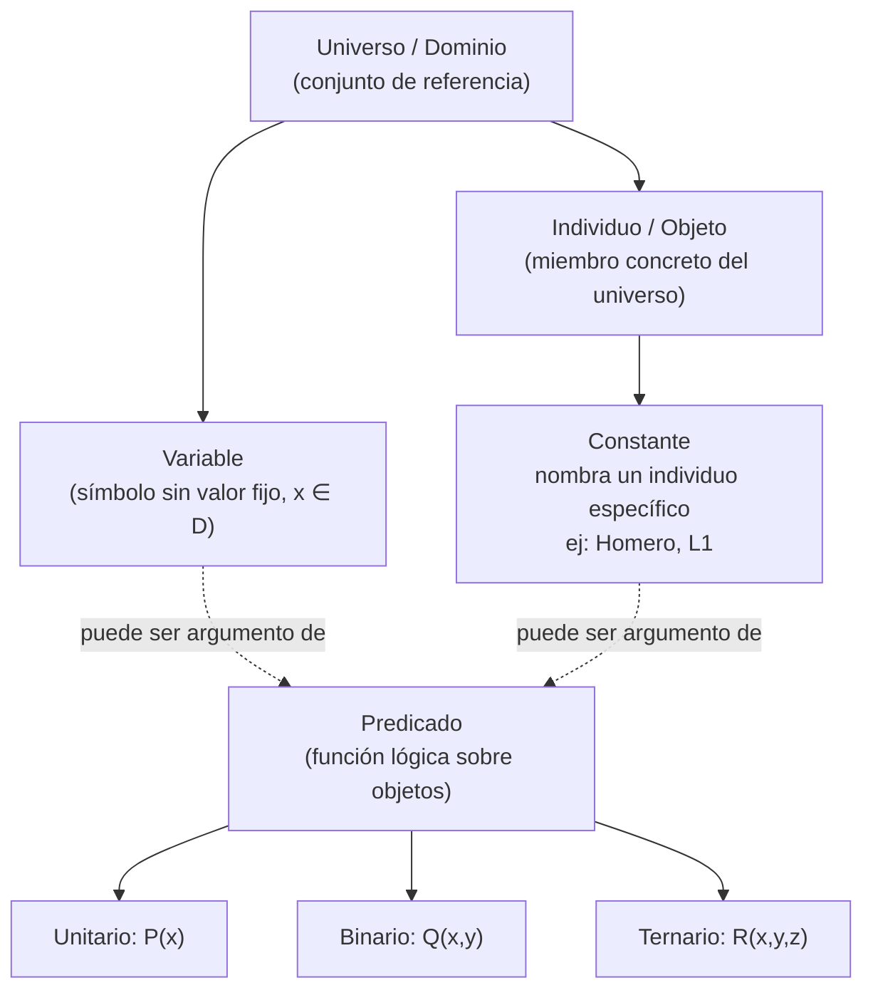

# Clase 07 — Introducción a la lógica cuantificacional

> **Fecha**: 03/09/2026, 08/09/2026, 10/09/2026 · **Modalidad**: Virtual sincrónica · **Apuntes**: [Diapositivas PDF](./apuntes_clase7.pdf) · [PPT](./apuntes_clase7.pptx) · [Manuscrito anotado](./apuntes_clase7_annotated.pdf)

## Objetivos de la clase

- Cerrar la unidad de lógica proposicional mediante un repaso general y evidenciar sus limitaciones como puente hacia un sistema lógico más expresivo.
- Presentar los conceptos fundamentales de la lógica cuantificacional (universo, variable, individuo, predicado, conjunto de verdad, cuantificadores y función proposicional) y su diferencia con la lógica proposicional.
- Establecer un proceso sistemático de traducción del lenguaje natural al lenguaje formal de la lógica de predicados, apoyado en las formas aristotélicas.
- Afianzar estos conceptos mediante ejercicios prácticos de traducción y evaluación de valores de verdad en distintos universos de discurso.

## Resumen

La clase se dictó en tres sesiones y sirvió de puente entre la lógica proposicional —cerrada con un repaso general y el análisis de sus limitaciones— y la lógica cuantificacional, presentada como una extensión que separa sujeto y predicado. En la primera sesión se introdujeron los conceptos fundamentales (universo, variable, individuo, predicado, cuantificadores, modelo); en la segunda, el conjunto de verdad, los cuantificadores, la función proposicional, las expresiones compuestas y el proceso de traducción con las formas aristotélicas; en la tercera se reforzaron estos conceptos mediante cuatro ejercicios prácticos de traducción y evaluación de valores de verdad. Adicionalmente, el profesor informó un cambio de horario del primer parcial.

## Agenda

**Sesión 1 — 03/09/2026**

1. Repaso general de lógica proposicional (unidad mínima: la proposición; conectores lógicos; tablas de verdad; reglas de prioridad; equivalencias lógicas; reglas de inferencia; validez) como cierre de la unidad evaluada en el primer parcial. *(→ sección 1)*
2. Ejemplo de repaso de traducción de lenguaje natural a lenguaje formal ("Si doña Florinda no se encuentra con el profesor Jirafales, entonces fue que se voló con don Ramón"). *(→ sección 1)*
3. Presentación de las limitaciones de la lógica proposicional mediante el ejemplo de la sala de cómputo LIS (8 computadores), evidenciando la contradicción entre un enunciado general y varios enunciados particulares. *(→ sección 1)*
4. Introducción a la separación sujeto/predicado en el lenguaje natural y su traducción a la lógica de predicados (lógica cuantificacional). *(→ sección 2)*
5. Presentación de los conceptos fundamentales de la lógica de predicados —universo/dominio, variable, individuo/objeto y predicado— retomando el ejemplo del LIS. *(→ sección 3)*
6. Comparación tabular entre lógica proposicional y lógica de predicados, y presentación del concepto de modelo. *(→ secciones 2 y 4)*
7. Ejemplos adicionales de universo y de objeto/individuo con los dominios de los Transformers, los números reales, los apóstoles y los enteros. *(→ sección 3)*
8. Definición formal de predicado (unitario, binario, ternario) mediante el ejemplo de Ratchet y Optimus. *(→ sección 3)*
9. Definición de variable y constante, contrastando una variable sin valor fijo con una constante (Homero). *(→ sección 3)*
10. Recordatorios administrativos: fecha y modalidad del primer parcial (12 de septiembre, presencial), materiales permitidos, peso de los quices (5 %) y plazo del quiz de tablas de verdad (4 de septiembre). *(→ Evaluación)*

**Sesión 2 — 08/09/2026**

1. Aviso del cambio de horario del primer parcial (de 11:00 a.m. a 8:00 a.m.) por un cruce de espacios con otra materia, y precisión sobre los materiales permitidos en el examen. *(→ Evaluación)*
2. Definición de conjunto de verdad de un predicado, ilustrada con el predicado "autobot(x)". *(→ sección 5)*
3. Definición de los cuantificadores universal y existencial, ilustrados con el ejemplo de las caritas felices. *(→ sección 6)*
4. Definición de función proposicional y su conversión en proposición (asignación de valor a la variable o aplicación de un cuantificador), con ejemplos sobre los enteros. *(→ sección 7)*
5. Construcción de expresiones compuestas combinando predicados con conectores lógicos, y presentación de la tabla de verificación de tipos (conectores, predicados, funciones). *(→ sección 8)*
6. Comparación entre lenguaje formal e informal mediante el ejemplo de Homero Simpson. *(→ sección 9)*
7. Presentación del proceso de traducción de lenguaje natural a formal en seis pasos y de las cuatro formas aristotélicas (A, E, I, O). *(→ sección 9)*
8. Ejemplo 1 resuelto en clase: "todo jugador de baloncesto es alto", trabajado con dos universos de discurso distintos (jugadores de baloncesto, y personas en general). *(→ sección 10)*

**Sesión 3 — 10/09/2026**

1. Ejemplo 2 resuelto en clase: el zoológico (definición del universo de discurso y los predicados, traducción y evaluación del valor de verdad de seis enunciados). *(→ sección 10)*
2. Ejemplo 3 resuelto en clase: aplicación de las formas aristotélicas sobre el dominio de las personas, con los predicados "comediante" y "gracioso". *(→ sección 10)*
3. Ejemplo 4 resuelto en clase: búsqueda de un dominio que haga verdadero y otro que haga falso un mismo enunciado, para cuatro enunciados distintos. *(→ sección 10)*
4. Cierre de la clase con el resumen de los conceptos fundamentales de la lógica de primer orden y anuncio de los cuantificadores anidados como tema de la siguiente sesión. *(→ sección 11)*

## Contenido temático

A modo de referencia rápida, esta es la notación empleada a lo largo de la sección:

| Símbolo | Significado |
| --- | --- |
| `∀x` | Para todo x (cuantificador universal) |
| `∃x` | Existe al menos un x (cuantificador existencial) |
| `¬` | Negación |
| `∧` | Conjunción ("y") |
| `∨` | Disyunción ("o") |
| `→` | Implicación ("si... entonces") |
| `↔` | Doble implicación ("si y solo si") |
| `P(x)`, `Q(x)` | Predicado unario aplicado al objeto x |
| `R(x,y)`, `T(x,y,z)` | Predicado binario / ternario |
| `D`, `U` | Dominio o universo del discurso |
| `x ∈ D` | x pertenece al dominio D |
| LPO / FOL | Lógica de primer orden / *First Order Logic* (sinónimo de lógica cuantificacional o de predicados) |

### 1. Cierre de la lógica proposicional y sus limitaciones *(Sesión 1)*

Como cierre de la unidad evaluada en el primer parcial, el profesor hizo un repaso general de la lógica proposicional:

- Su unidad mínima es la **proposición** (enunciado cierto o falso, nunca ambos).
- Las proposiciones se relacionan entre sí mediante **conectores lógicos** (`¬, ∧, ∨, ⊕, →, ↔`).
- Dos proposiciones son **equivalentes** si `p ↔ q` es una tautología.
- La **validez** de un argumento se puede demostrar mediante tablas de verdad (enfoque basado en modelos) o mediante axiomas e identidades lógicas (enfoque axiomático).

A continuación, el profesor mostró las **limitaciones de la lógica proposicional** con un ejemplo: en la sala de cómputo LIS hay 8 computadores (L1 a L8). Del enunciado general "todos los computadores del LIS están funcionando correctamente" (`p`), la lógica proposicional **no permite concluir ni contradecir** enunciados particulares como "el computador L4 tiene el sistema operativo malo" (`r`), "L5 tiene un virus" (`s`) o "L7 no tiene teclado" (`t`), porque cada enunciado se trata como una proposición atómica e independiente, sin relación estructural con el enunciado general. Al analizarlos juntos con lo visto hasta el momento, se evidenció una contradicción entre `p` (verdadera) y los hechos particulares sobre L4, L5 y L7 (falsos), lo que llevó a la conclusión de que la lógica proposicional **se queda corta** para representar la realidad: se necesita un sistema que permita descomponer el enunciado en **sujeto** (de quién se habla) y **predicado** (lo que se dice de él) — la lógica de predicados o lógica cuantificacional.

### 2. De la lógica proposicional a la lógica de predicados: sujeto y predicado *(Sesión 1)*

En lógica de predicados se separa el sujeto del predicado y se modelan formalmente: el sujeto se representa como un **objeto o individuo** (variable), y el predicado, como una **propiedad o relación** (función) — así aparece anotado en el manuscrito de esta diapositiva introductoria; la sección 3 precisa que, formalmente, *individuo/objeto* (un valor concreto del dominio) y *variable* (un símbolo sin valor fijo que puede representar cualquier individuo) son conceptos distintos. Por ejemplo, "El computador L1 está funcionando correctamente" se descompone en el objeto `L1` y el predicado `funciona(x)` ("x está funcionando correctamente"), obteniendo la expresión `funciona(L1)`. Esta separación posibilita hablar de uno o varios individuos, definir reglas generales y realizar inferencias lógicas más potentes que en lógica proposicional.

La siguiente tabla, mostrada en clase, resume qué agrega la lógica de predicados frente a la proposicional:

| Lógica proposicional | Lógica de predicados |
|---|---|
| Solo proposiciones completas `p`, `q`, `r` | Objetos, propiedades, relaciones y reglas generales |
| No sabe *qué hay dentro* de `p` | Puede decir cosas de *cada objeto* |
| No usa cuantificadores | Usa cuantificadores: `∀` (para todo), `∃` (existe) |

### 3. Conceptos fundamentales de la lógica cuantificacional *(Sesión 1)*

La lógica de predicados (o lógica de primer orden, FOL: *First Order Logic*) complementa los conectores de la lógica proposicional con **predicados** que describen propiedades de los objetos y **cuantificadores** que permiten razonar sobre múltiples objetos a la vez. Sus conceptos clave, ilustrados con el ejemplo del LIS y de los Transformers:

| Elemento | Definición | Ejemplo |
|---|---|---|
| Universo / dominio | Conjunto de referencia sobre el que se razona; también llamado dominio del discurso. Es definido por quien modela el problema, por lo que depende del contexto. | `U = {L1, L2, ..., L8}`; `U = {Optimus, Elita, Megatron, ...}` (Transformers); números reales; apóstoles; enteros |
| Individuo / objeto | Miembro concreto del universo. | `L6`; `elita_one`; `π`; `Pedro`; `4` |
| Variable | Símbolo que representa un objeto cualquiera (no específico) del universo; no tiene valor fijo por sí sola. | `x` (un computador cualquiera del LIS) |
| Predicado | Función lógica que expresa una propiedad de un objeto o una relación entre objetos; describe qué es cierto respecto a los elementos del universo. | `funciona(x)`: "x está funcionando correctamente"; `enfermo(x)`: "x está enfermo" |

**Definición (aridad de un predicado).** Un predicado puede ser **unitario** (`P(x)`, propiedad de un objeto), **binario** (`Q(x,y)`, relación entre dos objetos) o **ternario** (`R(x,y,z)`, relación entre tres objetos). El profesor ilustró esta idea con la proposición "Ratchet le dijo a Optimus que está enfermo": `enfermo(x)` es un predicado unitario y `dijo(x,y,z)` es ternario, de modo que el enunciado se traduce como `dijo(Ratchet, Optimus, enfermo(Optimus))` — se aclaró que, en lógica de primer orden estricta, el tercer argumento debería ser una fórmula y no un término, pero se usó de forma informal para ilustrar la idea.

**Aplicación:** este concepto se usa en los Ejemplos 2 y 3 de la sección 10, donde se definen predicados unitarios sobre animales y personas.

Finalmente, se distinguió entre **variable** y **constante**: una variable (`x`) no tiene un valor fijo y puede representar cualquier objeto del dominio ("`x` es una persona" → `persona(x)`), mientras que una constante (`Homero`) se refiere a un individuo específico del universo ("Homero es una persona" → `persona(Homero)`).

El siguiente diagrama resume visualmente cómo se relacionan estos conceptos:

### 4. Modelo *(Sesión 1)*

**Definición.** Un **modelo** es una representación de la realidad construida a partir de ciertos elementos y reglas; en lógica, es una interpretación que asigna significado a los símbolos de un lenguaje lógico y que hace que un conjunto de fórmulas sea verdadero. En lógica proposicional, un modelo `w` mapea símbolos proposicionales a valores de verdad (por ejemplo, `w = {ClotildeDominaCalculo: 1, RamonDominaCalculo: 0} = {p, ¬q}`); en lógica cuantificacional, el concepto se retoma al trabajar con universos y predicados concretos a lo largo de la clase.

**Aplicación:** cada vez que en la sección 10 se fija un universo concreto (los computadores del LIS, los animales del zoológico, las personas) y se asignan predicados sobre él, se está construyendo, en esencia, un modelo.

### 5. Conjunto de verdad *(Sesión 2)*

**Definición.** El **conjunto de verdad** de un predicado `P(x)` es el subconjunto del dominio `D` formado por todos los elementos para los cuales el predicado es verdadero:

`{x ∈ D | P(x) es verdadero}`

**Lectura:** "el conjunto de todos los x que pertenecen a D, tales que P(x) es verdadero". Ejemplo: si `D` es el dominio de los Transformers y `autobot(x)` es el predicado "x es un autobot", el conjunto de verdad es `{x ∈ D | autobot(x)} = {Optimus, Elita, Ratchet, ...}`, de modo que `autobot(Optimus) = Verdadero` y `autobot(Megatron) = Falso`.

**Aplicación:** el Ejemplo 2 de la sección 10 evalúa, para cada uno de seis enunciados sobre el zoológico, si el conjunto de verdad correspondiente coincide con todo el dominio, está vacío, o algo intermedio.

### 6. Cuantificadores *(Sesión 2)*

**Definición.** Los **cuantificadores** son símbolos lógicos que indican cuántos elementos del dominio cumplen una propiedad:

- **Cuantificador universal (`∀x P(x)`)**: "para todo x, P(x)" — es verdadero si y solo si la propiedad `P` se cumple para **todos** los elementos del dominio.
- **Cuantificador existencial (`∃x P(x)`)**: "existe al menos un x tal que P(x)" — es verdadero si y solo si **al menos uno** de los elementos del dominio cumple la propiedad `P`.

Con el ejemplo de las "caritas felices" (dominio de caritas, predicado `smiling(x)`: "x es una carita feliz"), si solo algunas caritas están felices: `∃x smiling(x) = Verdadero` (hay al menos una) y `∀x smiling(x) = Falso` (no todas lo están); si todas las caritas están felices, ambos cuantificadores son verdaderos.

**Cuidado con la negación.** Negar un cuantificador no es lo mismo que negar su predicado: `¬∃x P(x)` (no existe ningún x que cumpla P) equivale a `∀x ¬P(x)` (para todo x, P(x) es falso) — la negación "atraviesa" el cuantificador y lo invierte, en vez de simplemente anteponerse a él. Este punto generó una pregunta específica de un estudiante durante el Ejemplo 2 (ver el aviso junto al enunciado V, en la sección 10).

**Aplicación:** los cuatro enunciados del Ejemplo 2 y los cuatro del Ejemplo 4 (sección 10) son, en su mayoría, aplicaciones directas de estas dos definiciones sobre distintos universos.

### 7. Función proposicional *(Sesión 2)*

**Definición.** Una **función proposicional** es una expresión lógica con variables libres que todavía no es una proposición completa (análoga a una función en cálculo antes de evaluarse). Se convierte en proposición de dos formas: asignando un valor concreto a su variable (`autobot(x = Optimus) = Verdadero`), o aplicándole un cuantificador (`∃x smiling(x) = Verdadero`, `∀x smiling(x) = Falso`).

Con el universo de los enteros (`U = ℤ`), se trabajaron los ejemplos `P(x)`: "x es mayor que 5" y `R(x,y,z)`: "x + y = z":

| Expresión | Concepto | Valor |
|---|---|---|
| `P(x)` | Función proposicional (1 variable) | — |
| `P(7)` | Proposición | Verdadera (`7 > 5`) |
| `P(3)` | Proposición | Falsa (`3 > 5` es falso) |
| `∀x P(x)` | Proposición general: "para todo x, x es mayor que 5" | Falsa |
| `∃x P(x)` | Proposición general: "existen enteros mayores que 5" | Verdadera |
| `R(x,y,z)` | Función proposicional (3 variables) | — |
| `R(2,-1,5)` | Proposición: `2 + (-1) = 5` | Falsa |
| `R(3,4,7)` | Proposición: `3 + 4 = 7` | Verdadera |
| `R(x,3,z)` | Función proposicional (2 variables) | — |

Se aclaró que muchos textos usan "predicado" y "función proposicional" como términos equivalentes, aunque formalmente **predicado** es el término más usado en lógica de primer orden.

**Aplicación:** todos los ejercicios de la sección 10 dependen de esta conversión — cada enunciado parte de una función proposicional que se convierte en proposición (verdadera o falsa) al aplicarle un cuantificador sobre el universo definido.

### 8. Expresiones compuestas y tabla de verificación de tipos *(Sesión 2)*

Las **expresiones compuestas** combinan predicados, funciones y cuantificadores mediante conectivos lógicos (`¬, ∧, ∨, →, ↔`), construyendo afirmaciones más complejas. Las expresiones con variables libres no son proposiciones (no tienen valor de verdad) hasta que se les aplica un cuantificador o se sustituyen sus variables. Ejemplo: "Optimus es un autobot que tiene cáncer" se traduce como `autobot(Optimus) ∧ cancer(Optimus)`.

Con los predicados `P(x)`: "x es un profesor" y `Q(x)`: "x es un ingeniero", la expresión compuesta "x es un profesor y x es un ingeniero" se traduce como `P(x) ∧ Q(x)`; al sustituir `x` por Charles Proteus Steinmetz (CPH), la expresión se convierte en la proposición `P(CPH) ∧ Q(CPH) = V ∧ V = V`.

Para distinguir los tres tipos de componentes lógicos se usó una **tabla de verificación de tipos**:

| Elemento | Opera sobre... | Produce... | Ejemplo |
|---|---|---|---|
| Conectivos (`↔, ∧, ∨, ¬, ...`) | Proposiciones | Una proposición | `P ∧ Q`, `¬P`, `P → Q` |
| Predicados (`=, <, ...`) | Objetos | Una proposición | `mayor_que(x,y)`, `x = y`, `par(x)` |
| Funciones | Objetos | Un objeto | `doble(x)`, `padre_de(x)`, `suma(x,y)` |

Ejemplos de funciones trabajados en clase: `doble(x): 2x` → `doble(2) = 4`; `padre_de(x): x` → `padre_de(Lisa) = Homero`.

**Aplicación:** los enunciados II y III del Ejemplo 2 (sección 10) combinan varios predicados con `∨` dentro del alcance de un mismo cuantificador, siguiendo este mismo patrón de expresión compuesta.

### 9. Traducción de lenguaje natural a lenguaje formal *(Sesión 2)*

El profesor ilustró la importancia de traducir del lenguaje natural (informal) al lenguaje formal con el ejemplo de Homero Simpson: "Sin tele y sin cerveza, Homero pierde la cabeza" se traduce, con `C(x)`: "x es cerveza", `T(y)`: "y es tele" y `P(z)`: "z pierde la cabeza", como `(¬∃x C(x) ∧ ¬∃y T(y)) → P(h)`.

Se presentó un **proceso de traducción en seis pasos**:

1. Identificar las proposiciones simples o propiedades involucradas.
2. Definir las funciones proposicionales y constantes (el "diccionario").
3. Determinar el dominio del discurso (¿sobre qué universo hablamos?).
4. Identificar la estructura de la oración (universal, existencial, negada, condicional).
5. Aplicar la forma aristotélica correspondiente, si aplica.
6. Escribir la expresión en lógica de predicados y verificar que capture el significado original.

Las **formas aristotélicas** (A, E, I, O) son cuatro plantillas estándar para esta traducción:

| Forma | Nombre | Enunciado típico | Traducción en LPO | Conectivo clave |
|---|---|---|---|---|
| A | Universal afirmativa | "Todo S es P" | `∀x (S(x) → P(x))` | `∀` con `→` |
| E | Universal negativa | "Ningún S es P" | `∀x (S(x) → ¬P(x))` | `∀` con `→` y `¬` |
| I | Particular afirmativa | "Algún S es P" | `∃x (S(x) ∧ P(x))` | `∃` con `∧` |
| O | Particular negativa | "Algún S no es P" | `∃x (S(x) ∧ ¬P(x))` | `∃` con `∧` y `¬` |

> [!WARNING]
> **Error común (forma I)**: en la forma I se tiende a escribir `∃x (S(x) → P(x))` en lugar de `∃x (S(x) ∧ P(x))`. Con `→`, la expresión sería verdadera trivialmente cuando `S(x)` es falso para algún `x`, lo cual no captura el significado real de "algún S es P". Las formas aristotélicas son una guía, no una receta exhaustiva: el lenguaje natural puede requerir combinarlas.

**Aplicación:** el proceso de seis pasos y las formas aristotélicas se aplican en los cuatro ejercicios de la sección 10; el Ejemplo 3 en particular retoma el error común de la forma I con un caso real discutido en clase.

### 10. Ejercicios resueltos en clase

**Ejemplo 1 — jugadores de baloncesto** *(Sesión 2)*. En una frase: traducir "todo jugador de baloncesto es alto" cambia de forma según se restrinja o no el universo a los jugadores. Enunciado: "Para todo jugador de baloncesto x, x es alto" (`∀x (B(x) → A(x))`). Se resolvió con dos universos distintos:

- **Universo = jugadores de baloncesto**: basta un predicado, `alto(x)`, y la proposición es `∀x alto(x)` (forma A, con un solo predicado porque el universo ya está restringido a los jugadores).
- **Universo = todas las personas**: se requieren dos predicados, `basket(x)`: "x es jugador de baloncesto" y `alto(x)`: "x es alto", y la proposición es `∀x (basket(x) → alto(x))` (forma A).

**Ejemplo 2 — el zoológico** *(Sesión 3)*. En una frase: seis enunciados sobre un mismo universo de animales, traducidos a LPO y evaluados como verdaderos o falsos según los datos de la tabla. Universo: `D = {animales del zoológico}`, compuesto por 9 perros (7 café, 2 negros), 16 gatos (6 grises, 10 negros) y 12 pájaros (5 azules, 6 amarillos, 1 negro), para un total de 37 animales. Predicados: `D(x)`: x es perro; `C(x)`: x es gato; `B(x)`: x es pájaro/ave; `M(x)`: x es mamífero; y `café(x)`, `gris(x)`, `negro(x)`, `azul(x)`, `amarillo(x)` para el color de x.

| # | Enunciado | Traducción | Valor de verdad | Justificación |
|---|---|---|---|---|
| I | Hay un animal en el zoológico que es rojo | `∃x rojo(x)` | Falso | No hay ningún animal rojo en la tabla |
| II | Todo animal en el zoológico es un ave o es un mamífero | `∀x (B(x) ∨ M(x))` | Verdadero | Los pájaros son aves; los perros y gatos, mamíferos |
| III | Todo animal en el zoológico es de color café, gris o negro | `∀x (café(x) ∨ gris(x) ∨ negro(x))` | Falso | Hay pájaros azules y amarillos |
| IV | Hay un animal en el zoológico que no es ni gato ni perro | `∃x (¬C(x) ∧ ¬D(x))` | Verdadero | Hay pájaros en el zoológico |
| V | Ningún animal en el zoológico es de color azul | `¬∃x azul(x)` ≡ `∀x ¬azul(x)` | Falso | Hay 5 pájaros azules |
| VI | Hay en el zoológico un perro, un gato y un pájaro que tienen el mismo color | (requiere cuantificadores anidados — tema pendiente) | Verdadero | El color negro es común a perros, gatos y pájaros |

> [!TIP]
> **Sobre el enunciado V**: ante la pregunta de si la negación podía ubicarse fuera del cuantificador universal (`¬∀x azul(x)` en vez de `∀x ¬azul(x)`), el profesor aclaró que **no** son equivalentes — cambiaría el sentido del enunciado. La equivalencia correcta es `¬∃x azul(x) ≡ ∀x ¬azul(x)` ("no existe uno azul" = "para todo x, x no es azul"); la negación debe ubicarse en el lugar exacto que preserve el significado original.

**Ejemplo 3 — comediante y gracioso** *(Sesión 3)*. En una frase: cuatro expresiones formales sobre el mismo dominio, traducidas de vuelta a lenguaje natural para identificar a cuál forma aristotélica corresponde cada una (si corresponde a alguna). Universo: `D = {personas}`; predicados `C(x)`: "x es un comediante", `F(x)`: "x es gracioso".

| Expresión formal | Traducción a lenguaje natural | Forma aristotélica |
|---|---|---|
| `∀x (C(x) → F(x))` | Todo comediante es gracioso | A: "Todo S es P" |
| `∀x (C(x) ∧ F(x))` | Todos son comediantes y son graciosos | — |
| `∃x (C(x) → F(x))` | Existen personas que, si son comediantes, entonces son graciosas | No corresponde exactamente a una forma estándar: el conectivo condicional, aplicado con `∃`, no captura "algún S es P" (ver el error común de la forma I en la sección 9) |
| `∃x (C(x) ∧ F(x))` | Existen comediantes que son graciosos | I: "Algún S es P" |

**Ejemplo 4 — dominios verdaderos y falsos** *(Sesión 3)*. En una frase: un mismo enunciado puede ser verdadero o falso según el dominio de discurso que se elija, lo que ilustra por qué siempre hay que fijar el universo antes de evaluar una proposición cuantificada. Para cada enunciado se buscó un dominio que lo hiciera verdadero y otro que lo hiciera falso:

| Enunciado | Traducción | Dominio falso | Dominio verdadero |
|---|---|---|---|
| Todos hablan hindi | `∀x hindi(x)` | Habitantes de la Tierra | Habitantes de la India |
| Hay alguien mayor de 21 años | `∃x mayor21(x)` | Estudiantes de kínder | Estudiantes de la Ude@ |
| Cada dos personas tienen el mismo nombre | — | Familia Simpson | Habitantes de un pueblo de Colombia |
| Alguien conoce a más de otras dos personas | — | El primer humano en Marte | Habitantes de Colombia |

### 11. Resumen de conceptos (cheat-sheet) *(Sesión 3)*

La clase cerró con esta tabla resumen de los bloques fundamentales de la lógica de primer orden, útil como referencia rápida de repaso:

| Concepto | ¿Qué es? | Ejemplo |
|---|---|---|
| Universo / dominio | Conjunto de todos los objetos sobre los que se razona | `{L1, L2, ..., L8}` |
| Objeto / individuo | Elemento concreto del universo | `L1`, `Optimus`, `π` |
| Constante | Símbolo que nombra un objeto específico | `homero`, `ratchet` |
| Variable | Símbolo que representa cualquier objeto del dominio | `x, y, z` |
| Predicado | Propiedad o relación sobre objetos; produce V o F | `funciona(x)`, `medico(x,y)` |
| Función | Operación sobre objetos; produce otro objeto | `doble(x)`, `padre_de(x)` |
| Función proposicional | Expresión con variables libres; aún no es proposición | `P(x) ∧ Q(x)` |
| Conjunto de verdad | Subconjunto del dominio donde el predicado es verdadero | `{x ∈ D \| autobot(x)}` |
| Cuantificador universal `∀` | "Para todo x del dominio..." | `∀x funciona(x)` |
| Cuantificador existencial `∃` | "Existe al menos un x tal que..." | `∃x tiene_virus(x)` |

Una **fórmula bien formada (FBF)** en lógica de primer orden combina estos elementos; una función proposicional se convierte en proposición cuando se le asigna un valor a la variable o se le aplica un cuantificador. Quedó anunciado que los **cuantificadores anidados** —necesarios para expresar enunciados que involucran más de un dominio simultáneamente, como el enunciado VI del Ejemplo 2— se abordarán en la próxima sesión.

[Ver en el sitio](https://discretas1-udea.github.io/discretas1-udea-20262/lessons/mod2/clase6/) [[autoevaluación]](https://discretas1-udea.github.io/discretas1-udea-20262/lessons/mod2/clase6_autoevaluacion/) — nota teórica publicada más reciente sobre lógica cuantificacional al momento de esta clase; puede no cubrir aún la profundidad de los ejemplos y las formas aristotélicas trabajados en la sesión 2 y 3. *(Nota: la numeración del sitio teórico no corresponde 1 a 1 con la de este repositorio — "clase6" allí es la sexta unidad temática del sitio, no la sexta sesión de esta bitácora.)*

## Evaluación

| Ítem | Detalle |
|---|---|
| Primer parcial — fecha y hora | Sábado 12 de septiembre de 2026, modalidad presencial. Programado inicialmente para las 11:00 a.m., el profesor informó en la segunda sesión (8 de septiembre) que el horario se reprogramó a las **8:00 a.m.** por un cruce de espacios con la materia Lógica y Representación, ajeno a su control. |
| Primer parcial — materiales permitidos | Libros en formato físico (impresos) y apuntes de clase (manuscritos, incluyendo fórmulas y ejercicios). No se permite ningún dispositivo electrónico. El profesor proporcionará las fórmulas de tablas de verdad el día del examen. |
| Quices | Los quices disponibles en la plataforma (introducción a la lógica, tablas de verdad, enfoque axiomático, identidades lógicas y argumentación lógica) representan el 5 % de la nota, que sumado al 20 % del primer parcial completa el 25 % de la batería evaluativa correspondiente a esta unidad. |
| Quiz de tablas de verdad | Estuvo disponible hasta el viernes 4 de septiembre de 2026, con múltiples intentos permitidos (se toma la nota más alta). |

## Pendientes

### Docente

- [ ] Publicar los quices 3 y 4 (enfoque axiomático, identidades lógicas y argumentación lógica) entre el 3 y el 4 de septiembre de 2026.
- [ ] Publicar la solución del ejercicio pendiente de la clase anterior (anunciada el 3 de septiembre).
- [ ] Enviar a coordinación las instrucciones oficiales del parcial con el nuevo horario (8:00 a.m.).

### Estudiantes

- [ ] Completar el quiz de tablas de verdad antes del cierre del viernes 4 de septiembre de 2026 (varios intentos permitidos; se toma la nota más alta).
- [ ] Confirmar en el foro del curso el horario y la sede asignada para el primer parcial (8:00 a.m., 12 de septiembre); quien no tenga sede confirmada debe verificar con coordinación.
- [ ] Repasar los talleres 1, 2 y 3 de lógica proposicional y los parciales anteriores con solución disponibles en el repositorio del curso (uno de ellos contiene un error sin corregir).

## Próxima clase

Se profundizará en los cuantificadores universal y existencial, y se abordarán los cuantificadores anidados, necesarios para expresar enunciados que involucran más de un dominio simultáneamente.
