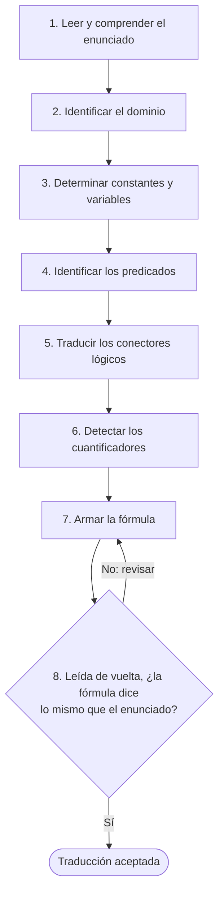
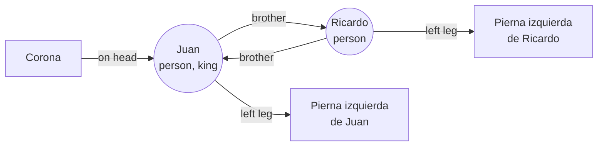
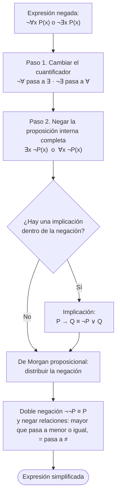
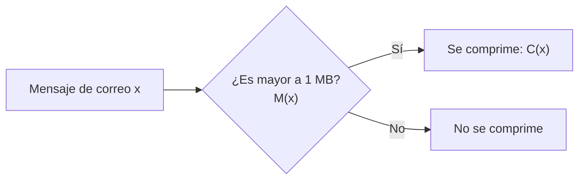

# Clase 09 — Equivalencias en lógica cuantificacional

> **Fecha**: 22/09/2026, 24/09/2026 · **Modalidad**: Virtual sincrónica · **Apuntes**: [Diapositivas PDF](./apuntes_clase9.pdf) · [PPT](./apuntes_clase9.pptx) · [Manuscrito anotado](./apuntes_clase9_annotated.pdf) · [Manuscrito anotado de la clase 8, págs. 48–58 (inicio de la sesión del 22/09)](../clase-08/apuntes_clase8_annotated.pdf)

## Objetivos de la clase

- Cerrar la batería de ejercicios de traducción de la clase anterior y comunicar las condiciones del segundo parcial.
- Establecer que las equivalencias de la lógica proposicional siguen siendo válidas en la lógica cuantificacional, y presentar las equivalencias propias de los cuantificadores (leyes de De Morgan, distributividad y conmutatividad de cuantificadores del mismo tipo).
- Aplicar las leyes de De Morgan para cuantificadores a la negación de enunciados en lenguaje natural y de expresiones matemáticas.
- Afianzar la traducción de lenguaje natural a lógica de predicados con especificaciones de sistemas y enunciados que no encajan de forma directa en una forma aristotélica.

## Resumen

La clase se dictó en dos sesiones. La primera cerró los ejercicios de traducción pendientes de la clase 8 (francés, Java y Sócrates), anunció las condiciones del segundo parcial, repasó los conceptos de la lógica de primer orden y presentó las equivalencias cuantificacionales (leyes de De Morgan para cuantificadores, distributividad), cerrando con los primeros ejemplos de negación. La segunda sesión retomó esos ejemplos y resolvió ejercicios de negación con expresiones matemáticas y de traducción al lenguaje formal; en uno de ellos quedaron dos traducciones incorrectas, señaladas en este apunte, y el último ejemplo quedó de tarea.

## Agenda

**Sesión 1 — 22/09/2026**

1. Avisos sobre el segundo parcial y sobre la solución y las notas del primero. [*(→ Evaluación)*](#evaluación)
2. Resolución de los ejercicios pendientes de la batería de traducción de la clase 8: Ejemplo 4 (africanos que hablan francés), Ejemplo 5 (Java, con dos universos distintos), Ejemplo 6 ("algún estudiante… Java") y Ejemplo 7 (silogismo de Sócrates). [*(→ sección 1)*](#1-cierre-de-la-batería-de-traducción-de-la-clase-8)
3. Repaso de la lógica de primer orden: definición, ejemplo "cualquier equipo que pase a la final puede ser campeón", conceptos clave y pasos para traducir del lenguaje natural al formal. [*(→ sección 2)*](#2-repaso-de-lógica-de-primer-orden-y-proceso-de-traducción)
4. Repaso de las cuatro formas aristotélicas (A, E, I, O). [*(→ sección 3)*](#3-formas-aristotélicas)
5. Ejemplo integrador de Ricardo Corazón de León y el rey Juan, tabla resumen de la lógica de primer orden y tabla de verificación de tipos. [*(→ sección 4)*](#4-ejemplo-integrador-ricardo-corazón-de-león-y-el-rey-juan)
6. Repaso sobre cuantificadores: tabla comparativa, orden de cuantificadores anidados, precedencia y dominios finitos. [*(→ sección 5)*](#5-repaso-sobre-cuantificadores)
7. Equivalencias de la lógica proposicional aplicadas a la lógica cuantificacional. [*(→ sección 6)*](#6-equivalencias-lógicas-en-lógica-cuantificacional)
8. Cuantificadores y negaciones: leyes de De Morgan para cuantificadores, con ejemplos. [*(→ sección 7)*](#7-negación-de-cuantificadores-y-leyes-de-de-morgan)
9. Distributividad de los cuantificadores, con el ejemplo del parcial y el quiz. [*(→ sección 8)*](#8-distributividad-de-los-cuantificadores)
10. Tabla de equivalencias cuantificacionales. [*(→ sección 9)*](#9-tabla-de-equivalencias-cuantificacionales)
11. Presentación de la lista de seis ejemplos y resolución del Ejemplo 1 (político honesto; colombianos que comen frijoles con mazamorra). [*(→ sección 10)*](#10-ejemplos-de-negación-de-enunciados-cuantificados)
12. Primera resolución del Ejemplo 2 (estudiantes de esta clase y el curso de Java). [*(→ sección 10)*](#10-ejemplos-de-negación-de-enunciados-cuantificados)

**Sesión 2 — 24/09/2026**

1. Resolución completa del Ejemplo 2, con diagrama de Venn. [*(→ sección 10)*](#10-ejemplos-de-negación-de-enunciados-cuantificados)
2. Resolución del Ejemplo 3 (negaciones de `∀x (x² > x)` y `∃x (x² = 2)` sobre ℝ). [*(→ sección 10)*](#10-ejemplos-de-negación-de-enunciados-cuantificados)
3. Resolución del Ejemplo 4 (especificaciones de un sistema: correo comprimido y enlaces de red). [*(→ sección 11)*](#11-ejemplos-de-traducción-al-lenguaje-formal)
4. Resolución del Ejemplo 5 (cachivaches, aparatos raros y cosas). [*(→ sección 11)*](#11-ejemplos-de-traducción-al-lenguaje-formal)
5. Presentación del Ejemplo 6 (argumento de Lewis Carroll), asignado como tarea. [*(→ sección 11)*](#11-ejemplos-de-traducción-al-lenguaje-formal)
6. Avisos: solución del primer parcial publicada, material de repaso y posibles actividades de seguimiento. [*(→ Evaluación)*](#evaluación)

## Contenido temático

> [!NOTE]
> **Cómo leer este apunte.** Las secciones siguen el orden en que se dictó la clase. La sesión del 22/09 empezó sobre el manuscrito de la clase 8 (págs. 48–58, desde la marca "Fin: 17/09/2026 → Inicio: 22/09/2026") y continuó con el de esta clase. Como ambas baterías de ejercicios se numeran desde 1, los ejercicios de la clase 8 se identifican aquí como "Ejemplo N (clase 8)". Los recuadros y párrafos que empiezan con **"Aclaración del apunte"** son explicaciones agregadas al redactar este documento, no dichas en clase; los que relatan una pregunta o una respuesta sí ocurrieron en la sesión.

**Notación usada en este apunte:**

| Símbolo | Significado |
|---|---|
| `∀`, `∃` | Cuantificador universal ("para todo") y existencial ("existe al menos un"); ver [sección 5](#5-repaso-sobre-cuantificadores) |
| `∃!` | "Existe exactamente un" (cuantificador de unicidad, visto en la [clase 8](../clase-08/)) |
| `¬`, `∧`, `∨`, `⊕`, `→`, `↔` | Negación, conjunción, disyunción, disyunción exclusiva, condicional y bicondicional |
| `≡` | "Es lógicamente equivalente a". No es un conectivo dentro de una fórmula, sino una afirmación **sobre** dos fórmulas: tienen siempre el mismo valor de verdad ([sección 6](#6-equivalencias-lógicas-en-lógica-cuantificacional)) |
| `≢` | "No es lógicamente equivalente a" |
| `∴` | "Por lo tanto"; precede a la conclusión de un argumento |
| `P(x)` | Función proposicional: una expresión con una variable que no es verdadera ni falsa hasta que se fija el valor de `x` |
| `V`, `F` | Verdadero, falso |
| `ℕ`, `ℝ` | Números naturales, números reales |

Los nombres de predicados y constantes (en español o en inglés, en mayúsculas o no) se conservan tal como aparecen en el material de clase.

### 1. Cierre de la batería de traducción de la clase 8

Estos ejercicios usan las formas aristotélicas (A, E, I, O) vistas en la clase 8, que se repasan en la [sección 3](#3-formas-aristotélicas).

**Ejemplo 4 (clase 8) — de lenguaje formal a lenguaje natural.** Con `U = {x | x es un habitante del continente africano}` y `p(x)`: "x habla francés":

| Expresión formal | Lectura literal | Forma más natural |
|---|---|---|
| `∀x p(x)` | "Para todo africano x, x habla francés" | "Todo africano habla francés" / "Todos los africanos hablan francés" |
| `∃x p(x)` | "Existe al menos un africano x tal que x habla francés" | "Hay africanos que hablan francés" / "Algunos africanos hablan francés" |

**Ejemplo 5 (clase 8) — "Todos los estudiantes de esta clase han tomado un curso de Java"**, resuelto con dos universos distintos:

| | Forma 1 | Forma 2 |
|---|---|---|
| Universo | `U = {x \| x es estudiante de esta clase}` | `U = {x \| x es una persona}` |
| Predicados | `J(x)`: "x está tomando un curso de Java" | `E(x)`: "x es estudiante de este curso"; `J(x)`: "x está tomando un curso de Java" |
| Traducción | `∀x J(x)` | `∀x (E(x) → J(x))` (forma A) |

**Ejemplo 6 (clase 8) — "Algún estudiante de esta clase ha tomado un curso de Java"**. Con universo de todas las personas y los mismos predicados, se obtiene la forma I: `∃x (E(x) ∧ J(x))`. La diapositiva de solución muestra también la versión con universo restringido a los estudiantes de la clase: `∃x J(x)`.

*Aclaración del apunte:* en las diapositivas de solución de estos dos ejemplos, el predicado "x es estudiante de esta clase" se llama `S(x)` en lugar de `E(x)`; es el mismo predicado.

**Ejemplo 7 (clase 8) — silogismo de Sócrates.** Con universo de todas las personas, `H(x)`: "x es un hombre", `M(x)`: "x es mortal" y la **constante** `SOCRATES`:

| | Lenguaje natural | Lenguaje formal |
|---|---|---|
| Premisa 1 | "Todos los hombres son mortales" | `∀x (H(x) → M(x))` |
| Premisa 2 | "Sócrates es un hombre" | `H(SOCRATES)` |
| Conclusión | "Sócrates es mortal" | `∴ M(SOCRATES)` |

Sócrates es un individuo concreto, así que entra en el predicado como constante, sin cuantificador.

> [!TIP]
> **¿Qué universo elegir?** Un estudiante preguntó si en el parcial el universo siempre se da. El profesor aclaró que puede darse, pero si no, usted mismo puede definirlo: cualquier universo es válido siempre que tenga contexto y sea coherente con el enunciado. Como muestran las formas 1 y 2 del Ejemplo 5 (clase 8), un universo restringido simplifica la fórmula; uno amplio obliga a agregar predicados que "filtren" los elementos de interés.

[Ver en el sitio](https://discretas1-udea.github.io/discretas1-udea-20262/lessons/mod2/clase6/#v1-un-proceso-en-seis-pasos) — proceso de traducción del lenguaje natural al formal.

### 2. Repaso de lógica de primer orden y proceso de traducción

La **lógica de primer orden** (FOL, *First Order Logic*), también llamada lógica de predicados o lógica cuantificacional, es un sistema lógico para razonar sobre las propiedades de los objetos. Amplía los conectores de la lógica proposicional con:

- **Predicados**, que describen las propiedades de los objetos.
- **Funciones**, que relacionan los objetos entre sí.
- **Cuantificadores**, que permiten razonar sobre muchos objetos a la vez.

**Ejemplo: "Cualquier equipo que pase a la final puede ser campeón".**

| Lógica | Lectura | Expresión |
|---|---|---|
| Proposicional | "Si un equipo pasa a la final, entonces puede ser campeón" | `F → C` |
| Cuantificacional | "Para todo x, si x pasa a la final, entonces x puede ser campeón" | `∀x (F(x) → C(x))` |

Los conceptos clave que se deben tener claros son: universo o dominio, objetos o individuos, predicados, variables, conjunto de verdad, cuantificadores y funciones proposicionales.

**Pasos para traducir del lenguaje natural al lenguaje formal:**

1. Leer y comprender el enunciado completo.
2. Identificar el dominio del discurso.
3. Determinar las constantes y las variables.
4. Identificar los predicados.
5. Traducir los conectores lógicos (`∧`, `∨`, `⊕`, `¬`, `→`, `↔`).
6. Detectar los cuantificadores (`∃`, `∀`, `∃!`).
7. Armar la fórmula (apoyándose en las formas aristotélicas).
8. **Verificar la fidelidad de la traducción.**

Por ejemplo, "Juan es hermano de Ricardo" se traduce con dominio = personas, constantes Juan y Ricardo, y el predicado `Brother(x, y)`: "x es hermano de y", sin cuantificadores: `Brother(JUAN, RICARDO)`.

*Esquema del apunte* (los ocho pasos de la diapositiva, con el paso 8 como control de calidad):

*Aclaración del apunte:* el paso 8 es el que más se omite, y es el que detecta los errores de sentido. En la [sección 11](#11-ejemplos-de-traducción-al-lenguaje-formal) (Ejemplo 5, cachivaches) se ve lo que ocurre cuando se lo salta: dos traducciones incorrectas.

### 3. Formas aristotélicas

Las cuatro formas aristotélicas son proposiciones categóricas básicas que forman la base del silogismo clásico. En clase se presentaron como "plantillas" que ayudan a identificar qué cuantificador y qué conector usar:

| Forma | Enunciado | Lógica de predicados | Ejemplo |
|---|---|---|---|
| A: universal afirmativa | "Todos los S son P" | `∀x (S(x) → P(x))` | "Todos los hombres son mortales": `∀x (hombre(x) → mortal(x))` |
| E: universal negativa | "Ningún S es P" | `∀x (S(x) → ¬P(x))` | "Ningún cuadrado es círculo": `∀x (cuadrado(x) → ¬circulo(x))` |
| I: particular afirmativa | "Algún S es P" | `∃x (S(x) ∧ P(x))` | "Algún estudiante es ingeniero": `∃x (estudiante(x) ∧ ingeniero(x))` |
| O: particular negativa | "Algún S no es P" | `∃x (S(x) ∧ ¬P(x))` | "Algún pájaro no vuela": `∃x (pajaro(x) ∧ ¬vuela(x))` |

Observe el patrón: las formas universales (A, E) usan `→` y las particulares (I, O) usan `∧`.

*Aclaración del apunte:* las formas aristotélicas son una guía, no una receta exhaustiva para todo el lenguaje natural. Muchos enunciados no encajan directamente en ninguna de las cuatro, y ahí manda lo que el enunciado expresa. Los incisos 4 y 5 del Ejemplo 5 de los cachivaches ([sección 11](#11-ejemplos-de-traducción-al-lenguaje-formal)) muestran qué pasa cuando esto se olvida.

[Ver en el sitio](https://discretas1-udea.github.io/discretas1-udea-20262/lessons/mod2/clase7/) [[autoevaluación]](https://discretas1-udea.github.io/discretas1-udea-20262/lessons/mod2/clase7_autoevaluacion/)

### 4. Ejemplo integrador: Ricardo Corazón de León y el rey Juan

El ejemplo integrador parte de una figura con cuatro elementos: Ricardo Corazón de León, rey de Inglaterra de 1189 a 1199; su hermano menor, el malvado rey Juan, que reinó de 1199 a 1215; las piernas izquierdas de ambos, y una corona. En clase se ilustró además con los personajes de *Robin Hood* de Disney. La figura de la diapositiva (pág. 8 del manuscrito) relaciona así esos elementos:

A partir de la figura se definieron los elementos del lenguaje:

| Elemento | Definición |
|---|---|
| Dominio | `U₁`: Personas = {Juan, Ricardo, Robin Hood, …}; `U₂`: Cosas = {Corona, pie, dinero} |
| Variables | `x`, `y` |
| Constantes | Personas: Ricardo, Juan. Cosas: Corona, pierna |
| Predicados | `Brother(x,y)`, `OnHead(x,y)`, `Person(x)`, `King(x)`, `Broken(x)`, `Owns(x,y)`, `Wears(x,y)`, `Betrayed(x,y)`, `Evil(x)`, `Greedy(x)`, `IsCrown(x)` |
| Funciones | `LeftLeg(x)`: pierna izquierda de x |
| Cuantificadores | `∀`, `∃` |

Lo que dice el juglar (Alan-a-Dale), escrito en lógica de predicados:

| # | Enunciado | Representación |
|---|---|---|
| 1 | Ricardo es un rey | `King(Ricardo)` |
| 2 | Juan es una persona | `Person(Juan)` |
| 3 | Juan es hermano de Ricardo | `Brother(Juan, Ricardo)` |
| 4 | Juan traicionó a Ricardo | `Betrayed(Juan, Ricardo)` |
| 5 | Ricardo lleva puesta la corona | `Wears(Ricardo, Corona)` |
| 6 | Juan es malvado y codicioso | `Evil(Juan) ∧ Greedy(Juan)` |
| 7 | La pierna izquierda de Ricardo está rota | `Broken(LeftLeg(Ricardo))` |
| 8 | Todo rey es una persona | `∀x (King(x) → Person(x))` |
| 9 | El hermano de un rey es un rey | `∀x∀y (Brother(x,y) ∧ King(y) → King(x))` |
| 10 | Si alguien lleva puesta la corona, entonces es rey | `∀x (Wears(x, Corona) → King(x))` |
| 11 | Todo el que tiene la corona sobre su cabeza es rey | `∀x (OnHead(x, Corona) → King(x))` o `∀x∀y (IsCrown(y) ∧ OnHead(x,y) → King(x))` |

*Aclaración del apunte:* la figura muestra a Juan rotulado como rey y con la corona sobre la cabeza, mientras que los enunciados 1 y 5 afirman que el rey es Ricardo y que es él quien lleva la corona. La tabla transcribe **lo que dice el juglar**, tal como lo plantea la diapositiva ("suponga que el juglar dice ciertas cosas sobre los reyes").

En el manuscrito, los enunciados 9 y 11 quedaron señalados como ejemplos de **cuantificadores anidados** (ver [sección 5](#5-repaso-sobre-cuantificadores)), tema de la próxima clase. La función `LeftLeg` del enunciado 7 muestra la diferencia entre función y predicado: `LeftLeg(Ricardo)` es un **objeto** (una pierna), y `Broken(…)` convierte ese objeto en una **proposición**.

> [!TIP]
> **Aclaración del apunte.** Fíjese en el enunciado 10: "*Si alguien* lleva puesta la corona, *entonces* es rey". Aunque dice "alguien", no se traduce con `∃`, sino con `∀x (Wears(x, Corona) → King(x))`. El "alguien" dentro de un "si…, entonces…" significa "cualquiera que": la frase pone una **condición** que se aplica a todos. El enunciado 11 ("todo el que…") tiene la misma estructura. Téngalo presente para los incisos 4 y 5 del Ejemplo 5 de los cachivaches ([sección 11](#11-ejemplos-de-traducción-al-lenguaje-formal)).

**Tabla de verificación de tipos.** Es muy útil en problemas de lógica de primer orden, porque indica sobre qué opera cada componente (tipo de entrada) y qué produce (tipo de salida):

| Elemento | Opera sobre… | Produce… | Ejemplo |
|---|---|---|---|
| Conectivos (`↔`, `∧`, `∨`, `¬`, …) | Proposiciones | Una proposición | `P ∧ Q`, `¬P`, `P → Q` |
| Predicados (`=`, `<`, …) | Objetos | Una proposición | `mayor_que(x,y)`, `x = y`, `par(x)` |
| Funciones | Objetos | Un objeto | `doble(x)`, `padre_de(x)`, `suma(x,y)` |

*Fuente (aclaración del apunte):* el ejemplo de Ricardo y Juan, y la tabla resumen con la gramática de la lógica de primer orden que se mostró junto a él (pág. 13 del [manuscrito anotado](./apuntes_clase9_annotated.pdf)), están adaptados de Russell y Norvig, *Artificial Intelligence: A Modern Approach* (capítulo de lógica de primer orden).

### 5. Repaso sobre cuantificadores

Se retomó la tabla comparativa de `∀` y `∃` de la clase anterior (completa en la [clase 8, sección 2](../clase-08/#2-cuantificadores-universal-existencial-y-de-unicidad)). Lo esencial:

| Expresión | Es verdadera cuando… | Es falsa cuando… |
|---|---|---|
| `∀x P(x)` | `P(x)` es verdadera para **todo** x del dominio | Existe **al menos un** x para el cual `P(x)` es falsa |
| `∃x P(x)` | Existe **al menos un** x para el cual `P(x)` es verdadera | `P(x)` es falsa para **todo** x |

El valor de verdad de `∀x P(x)` y `∃x P(x)` depende tanto de la función proposicional `P(x)` como del dominio `U`. Además, se repasaron tres puntos:

- **El orden de cuantificadores distintos no es intercambiable**: `∀x∃y P(x,y) ≢ ∃y∀x P(x,y)`. Con `P(x,y)`: "y > x" sobre los naturales, `∀x∃y P(x,y)` es verdadero (siempre hay un número mayor que cualquier x dado), mientras que `∃y∀x P(x,y)` es falso (no existe un y mayor que todos los x a la vez).
- **Los cuantificadores tienen mayor precedencia que los operadores lógicos**: se aplican primero, sobre la fórmula más pequeña que los sigue. `∀x P(x) ∨ Q(x) ≡ (∀x P(x)) ∨ Q(x)`.
- **En un dominio finito y no vacío** `U = {x₁, x₂, …, xₙ}`: `∀x P(x) ≡ P(x₁) ∧ P(x₂) ∧ … ∧ P(xₙ)` y `∃x P(x) ≡ P(x₁) ∨ P(x₂) ∨ … ∨ P(xₙ)`.

> [!NOTE]
> **Aclaración del apunte: tres términos que se usan en el resto del documento.**
>
> - **Alcance** de un cuantificador: la parte de la fórmula sobre la que actúa. Por la regla de precedencia anterior, es la fórmula más pequeña que lo sigue, salvo que los paréntesis indiquen otra cosa. En `∀x (P(x) ∨ Q(x))` el alcance es todo el paréntesis; en `∀x P(x) ∨ Q(x)`, solo `P(x)`.
> - **Cuantificadores anidados**: un cuantificador dentro del alcance de otro, como en `∀x∃y P(x,y)`.
> - **Precedencia entre conectivos**: la tabla resumen de la lógica de primer orden mostrada en clase (pág. 13) fija el orden `¬`, `=`, `∧`, `∨`, `→`, `↔`, de mayor a menor. Por eso `∧` se agrupa antes que `→`: `F(x) ∧ S(x) → T(x)` se lee `(F(x) ∧ S(x)) → T(x)`. Cuando haya duda, escriba los paréntesis.

### 6. Equivalencias lógicas en lógica cuantificacional

Todas las equivalencias de la lógica proposicional **siguen siendo válidas en la lógica cuantificacional**. Se aplican a las fórmulas dentro del alcance de los cuantificadores, sustituyendo las variables proposicionales (`P`, `Q`, `R`) por funciones proposicionales (`P(x)`, `Q(x)`, `R(x)`).

<b>Tabla de equivalencias de la lógica proposicional</b> (pág. 18 del manuscrito; clic para desplegar)

| Nombre | Equivalencia lógica |
|---|---|
| Conmutatividad | `P ∧ Q ≡ Q ∧ P` · `P ∨ Q ≡ Q ∨ P` |
| Asociatividad | `P ∧ (Q ∧ R) ≡ (P ∧ Q) ∧ R` · `P ∨ (Q ∨ R) ≡ (P ∨ Q) ∨ R` |
| Distributividad | `P ∧ (Q ∨ R) ≡ (P ∧ Q) ∨ (P ∧ R)` · `P ∨ (Q ∧ R) ≡ (P ∨ Q) ∧ (P ∨ R)` |
| Idempotencia | `P ∧ P ≡ P` · `P ∨ P ≡ P` |
| Doble negación | `¬(¬P) ≡ P` |
| Leyes de De Morgan | `¬(P ∧ Q) ≡ ¬P ∨ ¬Q` · `¬(P ∨ Q) ≡ ¬P ∧ ¬Q` |
| Identidad | `P ∧ V ≡ P` · `P ∨ F ≡ P` |
| Dominación | `P ∧ F ≡ F` · `P ∨ V ≡ V` |
| Absorción | `P ∧ (P ∨ Q) ≡ P` · `P ∨ (P ∧ Q) ≡ P` |
| Complemento | `P ∧ ¬P ≡ F` · `P ∨ ¬P ≡ V` |
| Implicación | `P → Q ≡ ¬P ∨ Q` |
| Contrarrecíproco | `P → Q ≡ ¬Q → ¬P` |
| Equivalencia | `P ↔ Q ≡ (P → Q) ∧ (Q → P)` |

En el manuscrito se resaltaron las dos que más se usan en los ejemplos de esta clase:

- **Doble negación**: `¬(¬P) ≡ P`
- **Implicación**: `P → Q ≡ ¬P ∨ Q`

Dos afirmaciones con predicados y cuantificadores son **lógicamente equivalentes** (`S ≡ T`) si y solo si tienen el mismo valor de verdad para cada predicado sustituido en ellas y para cada dominio del discurso usado para las variables. Por ejemplo, la doble negación aplicada a funciones proposicionales da `∀x ¬¬S(x) ≡ ∀x S(x)`.

Las equivalencias sirven para transformar expresiones sin cambiar su significado lógico, simplificar pruebas y aplicar reglas de inferencia o deducción natural.

### 7. Negación de cuantificadores y leyes de De Morgan

Los cuantificadores existencial y universal están conectados a través de la negación: **cuando se niega una afirmación cuantificada, el cuantificador cambia**.

- Negar que "para todo x se cumple P(x)" es lo mismo que decir que "existe al menos un x tal que P(x) no se cumple": `¬∀x P(x) ≡ ∃x ¬P(x)`, en resumen `¬∀ ≡ ∃`.
- Negar que "existe x tal que P(x) se cumple" es lo mismo que decir que "para todo x, P(x) no se cumple": `¬∃x P(x) ≡ ∀x ¬P(x)`, en resumen `¬∃ ≡ ∀`.

**Leyes de De Morgan para cuantificadores:**

| Equivalencia lógica | ¿Cuándo es cierta la negación? | ¿Cuándo es falsa la negación? |
|---|---|---|
| `¬∀x P(x) ≡ ∃x ¬P(x)` | Hay un x para el que `P(x)` es falsa | `P(x)` es verdadera para todo x |
| `¬∃x P(x) ≡ ∀x ¬P(x)` | `P(x)` es falsa para todo x | Hay un x para el cual `P(x)` es verdadera |

Con estas leyes es posible decir lo mismo usando cuantificadores distintos. Por ejemplo, "a todos les gusta volar" (`∀x P(x)`, ilustrado con *Los Magníficos*):

`∀x P(x) ≡ ¬¬(∀x P(x)) ≡ ¬(¬∀x P(x)) ≡ ¬∃x ¬P(x)`

es decir, "todos les gusta volar" equivale a "no hay alguien a quien no le guste volar".

**Ejemplos:**

| Enunciado original | Forma lógica | Negación lógica | Enunciado negado |
|---|---|---|---|
| Todos los estudiantes aprobaron | `∀x Pass(x)` | `¬∀x Pass(x) ≡ ∃x ¬Pass(x)` | Algunos estudiantes no aprobaron |
| Existe un estudiante que aprobó | `∃x Pass(x)` | `¬∃x Pass(x) ≡ ∀x ¬Pass(x)` | Ningún estudiante aprobó |
| A nadie le gustan las espinacas | `∀x ¬Like(x, Espinacas)` | `¬∀x ¬Like(x, Espinacas) ≡ ∃x ¬(¬Like(x, Espinacas)) ≡ ∃x Like(x, Espinacas)` | A algunas personas les gustan las espinacas |

**Resumen de los pasos para negar:**

1. Cambiar el cuantificador (`∀ → ∃` o `∃ → ∀`).
2. Negar la proposición interna (`P → ¬P`).

Aplicado en clase a la forma A, **obtener la negación de `∀x (A(x) → B(x))`**:

`¬∀x (A(x) → B(x)) ≡ ∃x ¬(A(x) → B(x)) ≡ ∃x ¬(¬A(x) ∨ B(x)) ≡ ∃x (A(x) ∧ ¬B(x))`

> [!TIP]
> Un estudiante preguntó si, al negar una expresión con forma aristotélica, se niegan los dos elementos dentro del paréntesis. El profesor confirmó que sí: primero se aplica De Morgan para cuantificadores (cambiando el cuantificador) y luego se niega la expresión interna **completa**. Eso puede requerir la definición de la implicación y De Morgan proposicional, como en el ejemplo anterior.

*Esquema del apunte* (el procedimiento que se siguió en los ejemplos de negación de esta clase):

*Aclaración del apunte:* el resultado de negar `∀x (A(x) → B(x))`, es decir `∃x (A(x) ∧ ¬B(x))`, tiene la forma O de la [sección 3](#3-formas-aristotélicas): negar una forma A ("todos los A son B") da una forma O ("algún A no es B").

[Ver en el sitio](https://discretas1-udea.github.io/discretas1-udea-20262/lessons/mod2/clase6/#iii3-negar-un-cuantificador) · [ejercicios de negación](https://discretas1-udea.github.io/discretas1-udea-20262/lessons/mod2/clase7/#ejercicio-10--negar-un-existencial-y-un-universal-en-lenguaje-cotidiano)

### 8. Distributividad de los cuantificadores

Los cuantificadores `∀` y `∃` se comportan de manera distinta frente a `∧` y `∨`: cada uno se distribuye completamente solo sobre uno de ellos.

- El **universal** se distribuye sobre la **conjunción**: `∀x (P(x) ∧ Q(x)) ≡ ∀x P(x) ∧ ∀x Q(x)`
- El **existencial** se distribuye sobre la **disyunción**: `∃x (P(x) ∨ Q(x)) ≡ ∃x P(x) ∨ ∃x Q(x)`

**No funciona igual** para `∀` con `∨`, ni para `∃` con `∧`:

- `∀x (P(x) ∨ Q(x)) ≢ ∀x P(x) ∨ ∀x Q(x)`
- `∃x (P(x) ∧ Q(x)) ≢ ∃x P(x) ∧ ∃x Q(x)`

En resumen:

| | Sobre `∧` | Sobre `∨` |
|---|---|---|
| `∀` | ✓ Se distribuye | ✗ No se distribuye |
| `∃` | ✗ No se distribuye | ✓ Se distribuye |

**Ejemplo del parcial y el quiz.** Sea `P(x)`: "x aprobó el parcial" y `Q(x)`: "x aprobó el quiz", sobre el dominio de los estudiantes del curso:

- "Todos aprobaron el parcial y el quiz" es exactamente lo mismo que decir "todos aprobaron el parcial" y "todos aprobaron el quiz".
- "Existe un estudiante que aprobó el parcial o el quiz" es exactamente lo mismo que decir "existe alguien que aprobó el parcial" o "existe alguien que aprobó el quiz".

**Ejemplo de Bart y Milhouse.** Con los mismos predicados y el mismo dominio, suponga que Milhouse aprobó el parcial pero no el quiz, y Bart aprobó el quiz pero no el parcial. ¿Qué se puede decir de "todos aprobaron el parcial o el quiz" frente a "todos aprobaron el parcial o todos aprobaron el quiz"?

**Aclaración del apunte.** El manuscrito plantea el caso sin resolverlo por escrito. Con los datos del enunciado:

| Frase | Fórmula | Valor de verdad | Por qué |
|---|---|---|---|
| "Todos aprobaron el parcial o el quiz" | `∀x (P(x) ∨ Q(x))` | Verdadera | Cada uno aprobó al menos una de las dos pruebas |
| "Todos aprobaron el parcial o todos aprobaron el quiz" | `∀x P(x) ∨ ∀x Q(x)` | Falsa | Bart no aprobó el parcial, así que `∀x P(x)` es falsa; Milhouse no aprobó el quiz, así que `∀x Q(x)` es falsa |

Las dos frases tienen distinto valor de verdad en la misma situación, así que no son equivalentes: el universal no se puede distribuir sobre la disyunción.

### 9. Tabla de equivalencias cuantificacionales

El profesor compartió esta tabla como referencia, análoga a la tabla de equivalencias proposicionales usada en el primer parcial:

| Nombre | Equivalencia lógica |
|---|---|
| Negación de cuantificadores (De Morgan para cuantificadores) | `¬∃x P(x) ≡ ∀x ¬P(x)` · `¬∀x P(x) ≡ ∃x ¬P(x)` |
| Distribución del cuantificador universal sobre la conjunción | `∀x (P(x) ∧ Q(x)) ≡ ∀x P(x) ∧ ∀x Q(x)` |
| Distribución del cuantificador existencial sobre la disyunción | `∃x (P(x) ∨ Q(x)) ≡ ∃x P(x) ∨ ∃x Q(x)` |
| Distribución de cuantificadores (si la fórmula `Q` no contiene la variable cuantificada `x`) | `∀x (P(x) ∧ Q) ≡ (∀x P(x)) ∧ Q` · `∃x (P(x) ∨ Q) ≡ (∃x P(x)) ∨ Q` |
| Conmutatividad de cuantificadores del mismo tipo | `∀x∀y P(x,y) ≡ ∀y∀x P(x,y)` · `∃x∃y P(x,y) ≡ ∃y∃x P(x,y)` |

> [!WARNING]
> **Cuidado**: las siguientes combinaciones no son equivalencias completas, solo una dirección es válida:
>
> - `∀x P(x) ∨ ∀x Q(x) → ∀x (P(x) ∨ Q(x))`, pero `∀x (P(x) ∨ Q(x)) ≢ ∀x P(x) ∨ ∀x Q(x)`
> - `∃x (P(x) ∧ Q(x)) → ∃x P(x) ∧ ∃x Q(x)`, pero `∃x P(x) ∧ ∃x Q(x) ≢ ∃x (P(x) ∧ Q(x))`
>
> La conmutatividad solo vale para cuantificadores **del mismo tipo**. Si son de tipos distintos, el orden importa ([sección 5](#5-repaso-sobre-cuantificadores)); esto se desarrollará en la próxima clase con los cuantificadores anidados.

[Ver en el sitio](https://discretas1-udea.github.io/discretas1-udea-20262/lessons/mod2/clase8/#parte-iv--equivalencias-cuantificacionales) [[autoevaluación]](https://discretas1-udea.github.io/discretas1-udea-20262/lessons/mod2/clase8_autoevaluacion/) — la página del sitio está dedicada principalmente a los cuantificadores anidados (tema de la próxima clase); su Parte IV cubre las equivalencias cuantificacionales.

### 10. Ejemplos de negación de enunciados cuantificados

**Ejemplo 1 — "Hay un político honesto" y "Todos los colombianos comen frijoles con mazamorra".**

| | "Hay un político honesto" | "Todos los colombianos comen frijoles con mazamorra" |
|---|---|---|
| Universo | `U = {personas}` | `U = {colombianos}` |
| Variable | `p ∈ U` | `p ∈ U` |
| Predicados | `P(p)`: "p es un político"; `H(p)`: "p es honesto" | `F(p)`: "p come frijoles"; `M(p)`: "p come mazamorra" |
| Traducción | `∃p (P(p) ∧ H(p))` | `∀p (F(p) ∧ M(p))` (el "con" se traduce como `∧`) |
| Negación | `¬∃p (P(p) ∧ H(p)) ≡ ∀p ¬(P(p) ∧ H(p)) ≡ ∀p (¬P(p) ∨ ¬H(p))` | `¬∀p (F(p) ∧ M(p)) ≡ ∃p ¬(F(p) ∧ M(p)) ≡ ∃p (¬F(p) ∨ ¬M(p))` |

**Ejemplo 2 — "Todos los estudiantes de esta clase han tomado un curso de Java" y "Uno o más estudiantes de esta clase han hecho un curso de Java".** Se empezó al final de la sesión del 22/09 y se resolvió completo el 24/09. Dominio `U = {personas}`, variable `x ∈ U` (x es una persona), sin constantes, `E(x)`: "x es estudiante de esta clase" y `J(x)`: "x ha tomado un curso de Java". En el manuscrito (pág. 31), un diagrama de Venn muestra los conjuntos E y J como dos regiones que se cruzan dentro del universo de personas.

1. **Forma A**: `∀x (E(x) → J(x))`. Negación:

   `¬∀x (E(x) → J(x)) ≡ ∃x ¬(E(x) → J(x)) ≡ ∃x ¬(¬E(x) ∨ J(x)) ≡ ∃x (E(x) ∧ ¬J(x))`

   Es decir: "existe un estudiante de esta clase que no ha tomado un curso de Java".

2. **Forma I**: `∃x (E(x) ∧ J(x))`. Negación:

   `¬∃x (E(x) ∧ J(x)) ≡ ∀x ¬(E(x) ∧ J(x)) ≡ ∀x (¬E(x) ∨ ¬J(x))`

   Es decir: "para todo x, o x no es estudiante de esta clase o x no ha tomado un curso de Java".

> [!TIP]
> Un estudiante preguntó por el tercer paso de la negación de la forma A, donde aparece una doble negación. El profesor explicó que primero se reemplaza la implicación con `P → Q ≡ ¬P ∨ Q`. Al distribuir la negación con De Morgan, `¬(¬E(x))` se cancela por doble negación y vuelve a ser `E(x)`. Por eso el resultado final contiene `E(x)` afirmado y `J(x)` negado.

**Ejemplo 3 — negaciones de `∀x (x² > x)` y `∃x (x² = 2)`.** Dominio `U = ℝ = (−∞, ∞)`, variable `x ∈ ℝ`, `P(x)`: "x² > x" y `Q(x)`: "x² = 2".

1. `¬∀x (x² > x) ≡ ∃x ¬(x² > x) ≡ ∃x (x² ≤ x)`
2. `¬∃x (x² = 2) ≡ ∀x ¬(x² = 2) ≡ ∀x (x² ≠ 2)`

> [!TIP]
> Un estudiante preguntó si al negar un "mayor que" se niega la variable. El profesor aclaró que no: se cambia el operador de relación, como con las desigualdades en la recta numérica. La negación de `>` es `≤`, la de `≥` es `<` y, a otra pregunta de un estudiante, la de `=` es `≠`.

[Ver en el sitio](https://discretas1-udea.github.io/discretas1-udea-20262/lessons/mod2/clase7/#ejercicio-11--negar-la-forma-a-y-su-contraparte-existencial) — negación de la forma A y de su contraparte existencial.

### 11. Ejemplos de traducción al lenguaje formal

**Ejemplo 4 — especificaciones de un sistema.**

*Especificación 1: "Todo mensaje de correo mayor a un megabyte será comprimido".* El profesor la ilustró con este diagrama de decisión (pág. 33 del manuscrito):

- Universo: mensajes de correo; variable `x ∈ U`.
- `M(x)`: "x es mayor de 1 MB"; `C(x)`: "x será comprimido".
- Forma A: `∀x (M(x) → C(x))`. El diagrama muestra por qué es una implicación: la especificación solo dice qué pasa con los mensajes que cumplen la condición.

*Especificación 2: "Si un usuario está activo, al menos un enlace de red estará disponible".*

- Universo: enlaces; variable `x ∈ U`.
- `A`: "el usuario está activo" (una **proposición simple**, que no depende del universo); `D(x)`: "x está disponible".
- Traducción: `A → ∃x D(x)`. El antecedente es una proposición simple y el consecuente es una proposición existencial.

El profesor insistió en que la elección del universo es determinante: define la forma final de la expresión y puede simplificarla o complicarla.

> [!TIP]
> Un estudiante preguntó si `M(x)` podía escribirse directamente como la expresión matemática "x > 1 MB" en lugar de una letra. El profesor respondió que sí, porque esa expresión sigue siendo una proposición. Para `C(x)` se usó una letra porque "ser comprimido" no tiene un símbolo matemático equivalente.

**Ejemplo 5 — cachivaches, aparatos raros y cosas.** Sean `U = {cachivaches, aparatos raros, cosas}`, `F(x)`: "x es un cachivache", `S(x)`: "x es un aparato raro" y `T(x)`: "x es una cosa". Se pidió escribir en lenguaje formal:

1. **"Nada es un aparato raro"** ≡ "No hay aparatos raros": `¬∃x S(x)`, que equivale a "Todos los aparatos no son raros": `∀x ¬S(x)`.

> [!NOTE]
> **Aclaración del apunte.** La paráfrasis "Todos los aparatos no son raros" es la del manuscrito, pero en español también puede leerse como "no todos los aparatos son raros", que sería `¬∀x S(x)`, algo distinto. La fórmula `∀x ¬S(x)` debe leerse como "**para todo x, x no es un aparato raro**": ningún elemento del dominio es un aparato raro. Es la ley de De Morgan para cuantificadores de la [sección 7](#7-negación-de-cuantificadores-y-leyes-de-de-morgan): `¬∃x S(x) ≡ ∀x ¬S(x)`.

2. **"Todos los cachivaches son aparatos raros"** → forma A: `∀x (F(x) → S(x))`
3. **"Algunos cachivaches son cosas"** → forma I: `∃x (F(x) ∧ T(x))`
4. **"Si algún cachivache es un aparato raro, entonces también es una cosa"** (transcripción del manuscrito): `∃x (F(x) ∧ S(x) → T(x))`

> [!WARNING]
> **Error del profesor en clase.** Esta traducción, tal como quedó en el manuscrito y en la grabación del 24/09, **cambia el sentido del enunciado**. "Algún" suele asociarse con `∃`, pero aquí no expresa existencia: dentro de un "*si*…, *entonces*…", "algún cachivache" significa "cualquier cachivache". La frase afirma algo de **todos** los cachivaches que sean aparatos raros, no de uno en particular.
>
> Además, la fórmula del manuscrito casi no dice nada. Aplicando la implicación y luego De Morgan:
>
> `∃x ((F(x) ∧ S(x)) → T(x)) ≡ ∃x (¬(F(x) ∧ S(x)) ∨ T(x)) ≡ ∃x (¬F(x) ∨ ¬S(x) ∨ T(x))`
>
> Basta entonces que exista un solo elemento que no sea cachivache para que sea verdadera. La traducción correcta es la misma del inciso 5:
>
> `∀x ((F(x) ∧ S(x)) → T(x))`
>
> Es el mismo caso del enunciado 10 de Ricardo y Juan ([sección 4](#4-ejemplo-integrador-ricardo-corazón-de-león-y-el-rey-juan)): "*Si alguien* lleva puesta la corona, *entonces* es rey" se tradujo en clase con `∀`, no con `∃`. Compare también con el error común de la forma I señalado en la [clase 8](../clase-08/): usar `→` dentro de un `∃` casi nunca expresa lo que se quiere decir.

5. **"Cualquier cachivache que sea aparato raro, es también una cosa"** (transcripción del manuscrito): `∀x (F(x) ∧ S(x) ∧ T(x))`

> [!WARNING]
> **Error del profesor en clase.** Esta traducción, tal como quedó en el manuscrito y en la grabación del 24/09, **cambia el sentido del enunciado**. Con solo conjunciones, la fórmula afirma que *todo* elemento del dominio es a la vez un cachivache, un aparato raro y una cosa. El enunciado dice algo condicional: *si* algo es un cachivache *y* un aparato raro, *entonces* también es una cosa. "Que sea" introduce una condición, y una condición se traduce con una implicación:
>
> `∀x ((F(x) ∧ S(x)) → T(x))`
>
> Para comprobarlo: basta un elemento que no sea cachivache para que la fórmula del manuscrito sea falsa, mientras que el enunciado no dice nada sobre lo que no es cachivache. Es la estructura del enunciado 11 de Ricardo y Juan ([sección 4](#4-ejemplo-integrador-ricardo-corazón-de-león-y-el-rey-juan)): `∀x∀y (IsCrown(y) ∧ OnHead(x,y) → King(x))`.

> [!TIP]
> **Moraleja (incisos 4 y 5).** Estos dos incisos muestran el mismo error por lados opuestos: en el 5 se usó `∧` donde había una condición; en el 4 se tradujo "algún" por `∃` sin mirar qué afirmaba la frase completa. Traducir no es poner símbolos a partir de las palabras clave, ni encajar la frase sin pensar en una forma aristotélica. **Las formas aristotélicas son una guía, no una receta exhaustiva para todo el lenguaje natural.** Antes de dar por buena una traducción, haga el último paso del método ([sección 2](#2-repaso-de-lógica-de-primer-orden-y-proceso-de-traducción)): **verificar la fidelidad de la traducción**, leyendo la fórmula de vuelta en lenguaje natural y preguntándose si dice lo mismo que el enunciado. Si una traducción cambia el sentido de lo que se dice, el concepto no se entendió, aunque la fórmula "se vea" bien formada. Estos errores, cometidos por el propio profesor, muestran que nadie queda exento de esa verificación.

**Ejemplo 6 — argumento de Lewis Carroll (tarea).** Lewis Carroll (seudónimo de C. L. Dodgson), autor de *Alicia en el País de las Maravillas*, también escribió obras de lógica simbólica como *Symbolic Logic*. Escriba en lenguaje formal el siguiente argumento (premisas y conclusión), tomado de uno de sus libros:

- "Todos los leones son feroces."
- "Algunos leones no toman café."
- "Algunas criaturas feroces no toman café."

Este ejemplo quedó asignado como **tarea**. Después de resolverlo, puede contrastar su respuesta con el [ejercicio del sitio del curso](https://discretas1-udea.github.io/discretas1-udea-20262/lessons/mod2/clase7/#ejercicio-15--el-silogismo-de-los-leones-de-lewis-carroll).

[Ver en el sitio](https://discretas1-udea.github.io/discretas1-udea-20262/lessons/mod2/clase7/#ejercicio-13--formalizar-especificaciones-de-un-sistema) — formalización de especificaciones de un sistema.

### Síntesis de la clase

*Aclaración del apunte:* un resumen de lo esencial, sin contenido nuevo.

**Ideas clave:**

1. **Negar un cuantificador lo cambia de tipo** y niega todo su interior: `¬∀x P(x) ≡ ∃x ¬P(x)` y `¬∃x P(x) ≡ ∀x ¬P(x)` ([sección 7](#7-negación-de-cuantificadores-y-leyes-de-de-morgan)). Negar una forma A da una forma O.
2. **`∀` se distribuye sobre `∧` y `∃` sobre `∨`**, pero no al revés ([sección 8](#8-distributividad-de-los-cuantificadores)).
3. **Los cuantificadores se aplican antes que los conectivos**, y entre conectivos el orden es `¬`, `∧`, `∨`, `→`, `↔`. En caso de duda, escriba los paréntesis ([sección 5](#5-repaso-sobre-cuantificadores)).
4. **Todas las equivalencias proposicionales siguen valiendo** dentro del alcance de un cuantificador; en esta clase las más usadas fueron la implicación y la doble negación ([sección 6](#6-equivalencias-lógicas-en-lógica-cuantificacional)).
5. **Una traducción se verifica leyéndola de vuelta**: si cambia el sentido del enunciado, está mal, aunque encaje en una forma aristotélica ([sección 2](#2-repaso-de-lógica-de-primer-orden-y-proceso-de-traducción)).

> [!IMPORTANT]
> **Errores y dudas de esta clase.** Un repaso de lo que efectivamente ocurrió o se preguntó en las dos sesiones:
>
> - **Traducir "algún" por `∃` sin leer la frase completa** (error en clase, inciso 4 de los cachivaches). Dentro de un "si…, entonces…", "algún" significa "cualquier": se traduce con `∀` y `→`.
> - **Usar `∧` donde hay una condición** (error en clase, inciso 5 de los cachivaches). Una condición bajo `∀` se traduce con `→`.
> - **Negar una relación cambiando la variable** (duda en clase, Ejemplo 3). Se niega el operador: `>` pasa a `≤`, `≥` pasa a `<`, `=` pasa a `≠`.
> - **Perderse en la doble negación al negar una forma A** (duda en clase, Ejemplo 2). `¬(¬E(x))` vuelve a ser `E(x)`.
> - **Distribuir `∀` sobre `∨` o `∃` sobre `∧`** (advertencia del profesor, [sección 8](#8-distributividad-de-los-cuantificadores)). No son equivalencias.
> - **Leer "todos… no son" como "no todos son"** (paráfrasis del manuscrito, inciso 1 de los cachivaches). `∀x ¬S(x)` significa "ninguno es".

## Evaluación

| Ítem | Detalle |
|---|---|
| Segundo parcial | Presencial, sábado **10/10/2026**. Hora tentativa: 11:00–13:00. Por los inconvenientes del primer parcial, el profesor consultó a coordinación si se mantiene o cambia y avisará cuando tenga respuesta. |
| Temas del segundo parcial | Todo lo visto hasta la clase del 01/10/2026 (semana 9, inclusive). Lo que se vea después de esa fecha no entra. |
| Condiciones | Mismo formato que el primer parcial: se permite sacar notas manuscritas durante el examen. |
| Tipos de ejercicio | Traducción (con el universo dado, o definido por el estudiante si no se da), determinación de verdad o falsedad de enunciados cuantificados y negaciones. Según el profesor, es lo mismo que el primer parcial pero con enfoque cuantificacional. |
| Solución del primer parcial | Anunciada el 22/09 para esa noche o la mañana siguiente; el 24/09 el profesor confirmó que ya estaba disponible. Consúltela [aquí](../parciales/parcial1/discretas1_parcial1_2026-2_sol.pdf) ([enunciado](../parciales/parcial1/discretas1_parcial1_2026-2.pdf)). |
| Notas del primer parcial | Se compartirán la semana siguiente, antes del segundo parcial, para que cada estudiante conozca su situación académica. |
| Actividades de seguimiento | El profesor evalúa crear actividades de seguimiento tipo Quizizz para preparar el segundo parcial; se avisará por el foro. |

## Pendientes

### Docente

- [ ] Confirmar con coordinación la hora del segundo parcial (10/10/2026) y avisar a los estudiantes.
- [x] Publicar la solución del primer parcial (confirmado en la sesión del 24/09).
- [ ] Compartir las notas del primer parcial antes del segundo parcial.
- [ ] Actualizar los apuntes con el contenido de las semanas 8 y 9 y publicar, durante el fin de semana y vía foro, parciales de semestres anteriores y talleres de práctica.
- [ ] Evaluar la creación de actividades de seguimiento tipo Quizizz para el segundo parcial.

### Estudiantes

- [ ] Resolver el Ejemplo 6 (argumento de Lewis Carroll) como tarea.
- [ ] Revisar la solución del primer parcial y compararla con sus propias respuestas.
- [ ] Estar pendientes del foro del curso: hora definitiva del segundo parcial, actividades de seguimiento y material de repaso.
- [ ] Repasar con los parciales anteriores y los talleres de práctica cuando se publiquen.

## Próxima clase

Se abordarán los cuantificadores anidados: cuándo se puede intercambiar el orden de los cuantificadores y cuándo no, según su tipo ([sección 5](#5-repaso-sobre-cuantificadores)).
