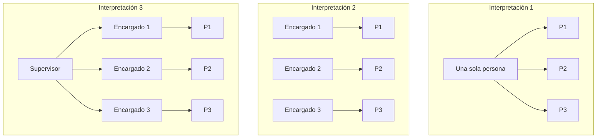
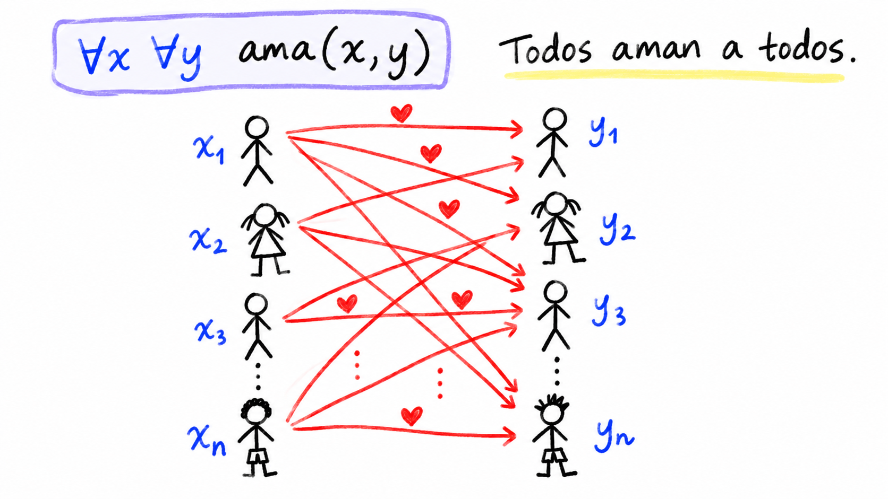
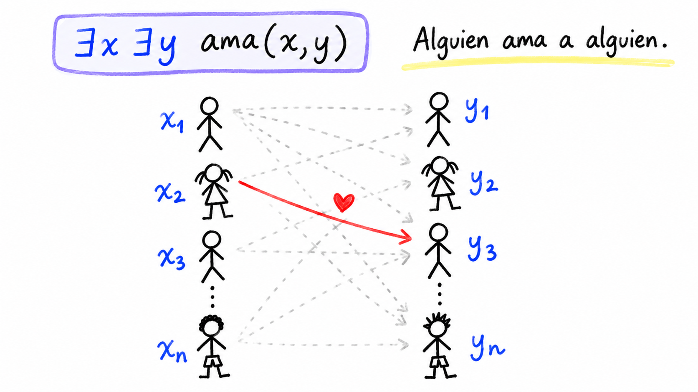
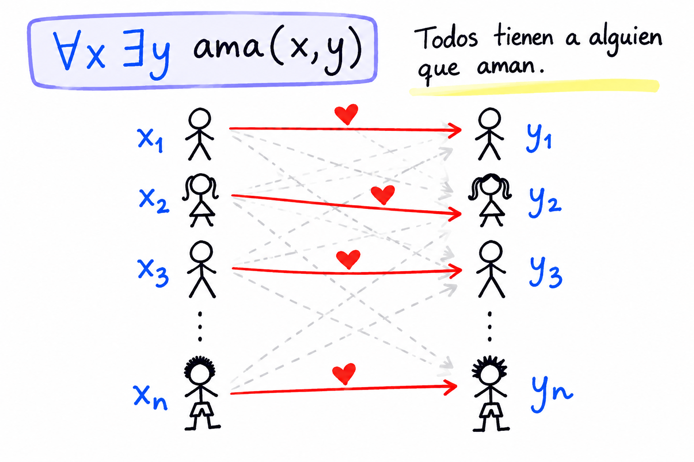
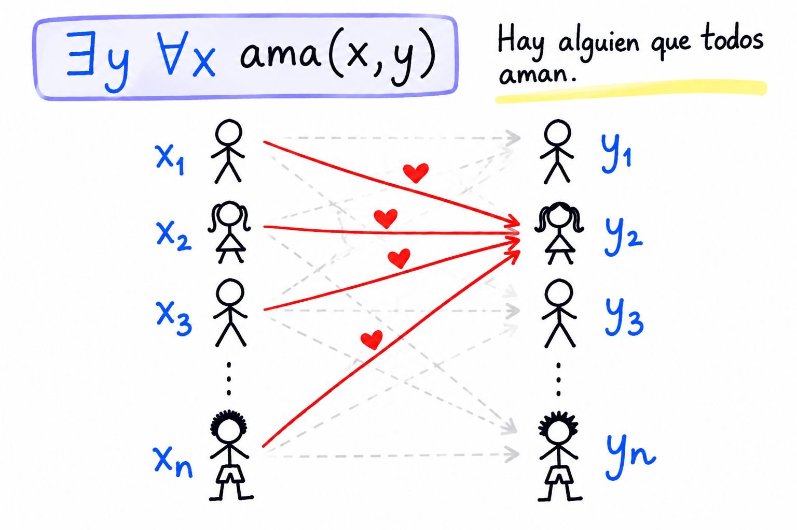
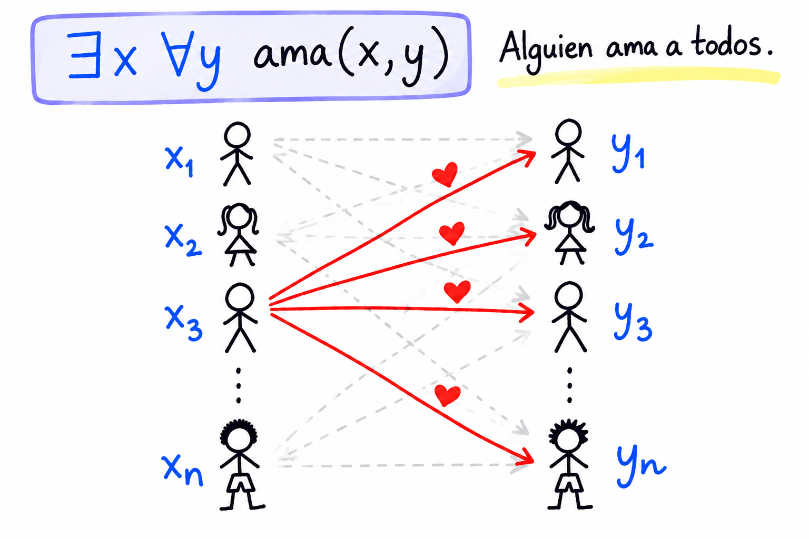
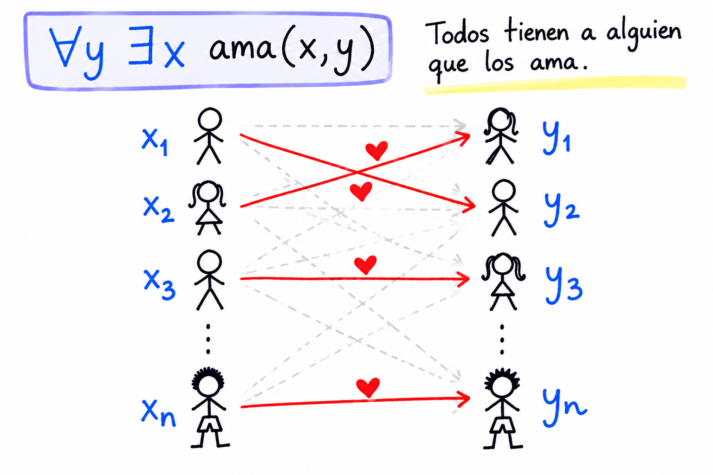
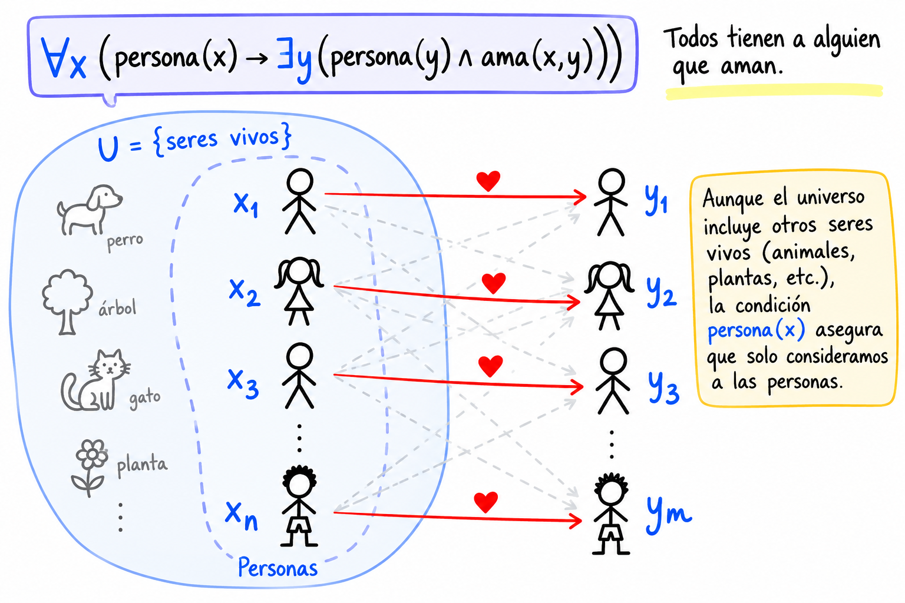
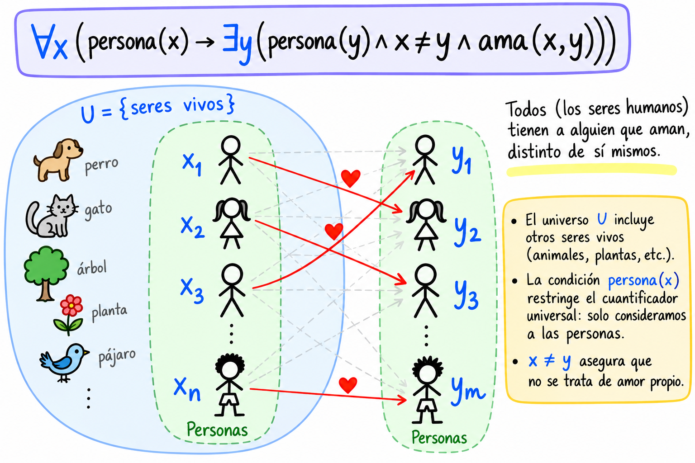

# Clase 10 — Cuantificadores anidados

> **Fecha**: 29/09/2026 · **Modalidad**: Virtual sincrónica · **Apuntes**: [Diapositivas PDF](./apuntes_clase10.pdf) · [PPT](./apuntes_clase10.pptx) · [Manuscrito anotado](./apuntes_clase10_annotated.pdf) · [Ejemplo 4 (clase 9) con cuantificadores anidados](./ejemplo_clase_09_annotated.pdf)

> [!IMPORTANT]
> **Corrección de la clase anterior.** En la sesión del 24/09 (clase 9), los incisos 4 y 5 del Ejemplo 5 de los cachivaches quedaron mal traducidos en el manuscrito y en la grabación. La versión corregida está al comienzo del contenido de esta clase: [Corrección de la clase anterior](#corrección-de-la-clase-anterior-ejemplo-5-de-los-cachivaches). Si repasa la clase 9 con el video, tenga en cuenta esta corrección.

## Objetivos de la clase

- Mostrar, con casos reales de ingeniería, por qué la ambigüedad del lenguaje natural es costosa y cómo la lógica formal ayuda a eliminarla.
- Distinguir los tres tipos de ambigüedad que busca eliminar la lógica formal: sintáctica, de alcance y semántica.
- Definir el alcance de un cuantificador y los cuantificadores anidados, y establecer que el orden de cuantificadores de distinto tipo cambia el significado de la expresión.
- Precisar una expresión con cuantificadores anidados agregando condiciones al dominio (universo ampliado, personas diferentes), y aplicarlo a un ejercicio de la clase anterior.

## Resumen

La clase empezó con los avisos sobre el segundo parcial y un repaso de la lógica cuantificacional. Con el caso de una fábrica de microchips y tres fallos reales de ingeniería (Mars Climate Orbiter, Ariane 5 y Hershey's), se presentó la ambigüedad y sus tres tipos en lógica. Luego se definieron el alcance y los cuantificadores anidados, se analizaron las seis combinaciones de dos cuantificadores con `ama(x,y)` y se refinó el modelo con condiciones adicionales. Se cerró reescribiendo con cuantificadores anidados un ejercicio de la clase 9. Quedaron dos tareas.

## Agenda

1. Avisos: segundo parcial, notas del primer parcial y ejercicios de preparación. [*(→ Evaluación)*](#evaluación)
2. Repaso: formas aristotélicas, tabla resumen de la lógica de primer orden, cuantificadores y equivalencias. [*(→ sección 1)*](#1-repaso-de-la-lógica-cuantificacional)
3. Caso de la fábrica de microchips: un enunciado con varias interpretaciones; definición de ambigüedad. [*(→ sección 2)*](#2-el-caso-de-la-fábrica-de-microchips)
4. Importancia del contexto: el salón frente a la calle y tres casos reales (Mars Climate Orbiter, Ariane 5, Hershey's). [*(→ sección 3)*](#3-importancia-del-contexto)
5. Los tres tipos de ambigüedad en lógica: sintáctica, de alcance y semántica. [*(→ sección 4)*](#4-tres-tipos-de-ambigüedad-en-lógica)
6. Cuantificadores anidados: alcance; "todos aman a alguien" frente a "alguien ama a todos". [*(→ sección 5)*](#5-cuantificadores-anidados-y-alcance)
7. Las seis combinaciones de dos cuantificadores con `ama(x,y)`. [*(→ sección 6)*](#6-las-seis-combinaciones-con-dos-variables)
8. Refinando el modelo: caso base, universo ampliado y personas diferentes. [*(→ sección 7)*](#7-refinando-el-modelo)
9. Recomendaciones y errores frecuentes con cuantificadores anidados. [*(→ sección 8)*](#8-recomendaciones-y-errores-frecuentes)
10. Ejercicios de repaso (tarea) y resumen de combinaciones. [*(→ sección 9)*](#9-ejercicios-de-repaso-y-resumen-de-combinaciones)
11. Ejemplo 4 de la clase 9 reescrito con cuantificadores anidados. [*(→ sección 10)*](#10-ejemplo-4-clase-9-con-cuantificadores-anidados)

## Contenido temático

> [!NOTE]
> **Cómo leer este apunte.**
>
> - Las secciones numeradas siguen el orden en que se dictó la clase. Antes de ellas hay una corrección de la clase anterior que **no** se dictó en esta sesión: se incluye al comienzo para que lo que aparece aquí quede correcto.
> - La sección 10 se trabajó sobre un archivo aparte: [Ejemplo 4 (clase 9) con cuantificadores anidados](./ejemplo_clase_09_annotated.pdf).
> - Los párrafos que empiezan con *Aclaración del apunte* se agregaron al redactar: no se dijeron en clase. Sirven para conectar ideas o evitar confusiones.

**Notación usada en este apunte**

| Símbolo | Se lee | Observación |
|---|---|---|
| `∀x` | "para todo x" | Cuantificador universal. |
| `∃x` | "existe (al menos) un x" | Cuantificador existencial. |
| `∃!x` | "existe un único x" | Cuantificador de unicidad, visto en una clase anterior; en esta clase solo se recordó. |
| `∀x ∃y P(x,y)` | "para todo x existe un y tal que P(x,y)" | **Cuantificadores anidados**: el `∃y` está dentro del alcance del `∀x`. |
| `≡` | "es equivalente a" | Afirma algo **sobre** dos fórmulas: tienen **siempre** el mismo valor de verdad, sea cual sea el universo y el significado de los predicados. |
| `→` | "si…, entonces…" | Conectivo **dentro** de una fórmula. |
| `x ≠ y` | "x es diferente de y" | Se usa como condición adicional (sección 7). |
| `x ∈ U` | "x pertenece al universo U" | Todas las variables toman valores en el universo U. |

### Corrección de la clase anterior: Ejemplo 5 de los cachivaches

*Esta corrección no se dictó en la sesión del 29/09: el profesor anunció que la retomará brevemente en la próxima clase.* El enunciado y la discusión completa están en la [sección 11 del apunte de la clase 9](../clase-09/README.md#11-ejemplos-de-traducción-al-lenguaje-formal).

Sean `U = {cachivaches, aparatos raros, cosas}`, `F(x)`: "x es un cachivache", `S(x)`: "x es un aparato raro" y `T(x)`: "x es una cosa". Estas son las traducciones correctas:

| # | Enunciado | Traducción correcta |
|---|---|---|
| 1 | "Nada es un aparato raro" | `¬∃x S(x) ≡ ∀x ¬S(x)` ("para todo x, x no es un aparato raro") |
| 2 | "Todos los cachivaches son aparatos raros" | `∀x (F(x) → S(x))` (forma A) |
| 3 | "Algunos cachivaches son cosas" | `∃x (F(x) ∧ T(x))` (forma I) |
| 4 | "Si algún cachivache es un aparato raro, entonces también es una cosa" | `∀x ((F(x) ∧ S(x)) → T(x))` |
| 5 | "Cualquier cachivache que sea aparato raro, es también una cosa" | `∀x ((F(x) ∧ S(x)) → T(x))` |

> [!WARNING]
> **Error del profesor en la clase anterior (incisos 4 y 5).** En el manuscrito y en la grabación del 24/09 quedaron estas traducciones, que **cambian el sentido** de los enunciados:
>
> - Inciso 4: `∃x (F(x) ∧ S(x) → T(x))`. Dentro de un "*si*…, *entonces*…", "algún cachivache" significa "**cualquier** cachivache": la frase habla de todos los cachivaches que sean aparatos raros, no de uno en particular. Por eso se traduce con `∀`. Además, la fórmula con `∃` y `→` casi no dice nada: basta que exista un elemento que no sea cachivache para que sea verdadera.
> - Inciso 5: `∀x (F(x) ∧ S(x) ∧ T(x))`. Con solo conjunciones, la fórmula afirma que **todo** elemento del universo es a la vez cachivache, aparato raro y cosa. El enunciado pone una **condición** ("que sea aparato raro"), y una condición bajo `∀` se traduce con `→`.
>
> Los dos incisos dicen lo mismo y tienen la misma traducción. Es la estructura de la restricción 1 de esta clase ([sección 7](#7-refinando-el-modelo)): `∀x (persona(x) → …)`.

> [!TIP]
> **Moraleja.** Traducir no es poner símbolos a partir de palabras clave: "algún" no siempre es `∃`. **Las formas aristotélicas son una guía, no una receta exhaustiva para todo el lenguaje natural.** Antes de dar por buena una traducción, léala de vuelta en lenguaje natural y pregúntese si dice lo mismo que el enunciado.

### 1. Repaso de la lógica cuantificacional

El profesor reconoció que esta parte del curso es la que más confunde, porque en el lenguaje natural muchas veces "se dice una cosa queriendo decir otra". Contó que él mismo todavía se equivoca, y que la clave es practicar.

**Formas aristotélicas** (págs. 2–3). Son las cuatro proposiciones categóricas básicas del silogismo clásico y sirven como guía para traducir:

| Forma | Enunciado | Lógica de predicados | Ejemplo |
|---|---|---|---|
| A: universal afirmativa | Todos los S son P | `∀x (S(x) → P(x))` | Todos los hombres son mortales: `∀x (hombre(x) → mortal(x))` |
| E: universal negativa | Ningún S es P | `∀x (S(x) → ¬P(x))` | Ningún cuadrado es círculo: `∀x (cuadrado(x) → ¬circulo(x))` |
| I: particular afirmativa | Algún S es P | `∃x (S(x) ∧ P(x))` | Algún estudiante es ingeniero: `∃x (estudiante(x) ∧ ingeniero(x))` |
| O: particular negativa | Algún S no es P | `∃x (S(x) ∧ ¬P(x))` | Algún pájaro no vuela: `∃x (pajaro(x) ∧ ¬vuela(x))` |

**Tabla resumen de la lógica de primer orden** (pág. 4). Es la tabla de gramática del libro *Artificial Intelligence: A Modern Approach* (Russell & Norvig), ya trabajada en la clase 9 ([sección 4 del apunte de la clase 9](../clase-09/README.md#4-ejemplo-integrador-ricardo-corazón-de-león-y-el-rey-juan)). Según el profesor, resume toda la lógica cuantificacional vista hasta ahora y vale la pena entenderla a fondo.

**Repaso sobre cuantificadores** (pág. 5).

| Característica | Universal `∀` | Existencial `∃` |
|---|---|---|
| Lectura común | "Para todo", "para cada", "para cualquier" | "Existe (al menos) un", "para algún", "hay algún" |
| Estructura típica | `∀x P(x)` | `∃x P(x)` |
| Condición de verdad | `P(x)` es verdadero para todo x | Hay algún x para el cual `P(x)` es verdadero |
| Condición de falsedad | Existe un x para el cual `P(x)` es falso | `P(x)` es falso para cada x |
| Palabras clave | Todos, cada, cualquiera, ninguno (con negación), siempre, para todo | Existe, algún, algunos, hay, al menos uno, a veces, para algún |

El valor de verdad de `∀x P(x)` y `∃x P(x)` depende tanto de la función proposicional `P(x)` como del dominio U.

**Equivalencias** (págs. 6–7). Todas las equivalencias de la lógica proposicional siguen valiendo en la lógica cuantificacional: basta cambiar las variables proposicionales (`P`, `Q`, `R`) por funciones proposicionales (`P(x)`, `Q(x)`, `R(x)`) dentro del alcance de los cuantificadores. A esas se suman las equivalencias propias de los cuantificadores, ya vistas en la [clase 9](../clase-09/README.md#9-tabla-de-equivalencias-cuantificacionales). En esta clase el profesor resaltó una de ellas porque se usa enseguida:

| Nombre | Equivalencia |
|---|---|
| Conmutatividad de cuantificadores **del mismo tipo** | `∀x ∀y P(x,y) ≡ ∀y ∀x P(x,y)` y `∃x ∃y P(x,y) ≡ ∃y ∃x P(x,y)` |

[Ver en el sitio](https://discretas1-udea.github.io/discretas1-udea-20262/lessons/mod2/clase8/#parte-iv--equivalencias-cuantificacionales) — equivalencias cuantificacionales.

### 2. El caso de la fábrica de microchips

**Situación** (pág. 8): usted visita una fábrica de microchips y el guía le dice:

> "**Hay** una persona que supervisa **todos** los detalles del proceso de producción."

¿Qué significa? En clase se dibujaron dos interpretaciones válidas, y un estudiante propuso una tercera:

*Figura de clase (pág. 8): P1, P2 y P3 son los procesos de producción; las flechas indican quién supervisa qué.*

1. **Interpretación 1**: una sola persona recorre todos los procesos y los supervisa ella sola.
2. **Interpretación 2**: cada proceso tiene su propio encargado, una persona distinta por proceso.
3. **Interpretación 3**: hay encargados por proceso y, por encima de ellos, una persona que los supervisa a todos.

> [!TIP]
> Un estudiante señaló que la interpretación 2 no es del todo fiel al enunciado ("**hay una** persona que supervisa todo"): para serlo, haría falta una persona por encima de los tres encargados. El profesor validó la observación, dibujó esa estructura en el manuscrito (interpretación 3) y comentó que, en una fábrica real, es la lectura que más sentido tiene.

**Ambigüedad**: falta de claridad en el significado de una expresión, debida a que puede tener múltiples interpretaciones válidas. Para aclarar una ambigüedad hay que dar más contexto. En una conversación, la herramienta básica es **preguntar**; en matemáticas y en ingeniería, la solución es hacer explícitos el universo de discurso y las restricciones.

*Aclaración del apunte:* la diferencia entre las interpretaciones 1 y 2 es el orden de "hay una persona" y "todos los procesos". En la 1, **existe** una persona que supervisa **todos** los procesos: es la misma para todos. En la 2, para **cada** proceso **existe** alguien que lo supervisa, y puede ser una persona distinta en cada uno. Es la misma diferencia que hay entre los casos 5 (`∃x ∀y`) y 6 (`∀y ∃x`) de la [sección 6](#6-las-seis-combinaciones-con-dos-variables).

### 3. Importancia del contexto

- En la vida cotidiana son comunes las situaciones ambiguas y, aunque el contexto ayuda, a veces simplemente entendemos mal. El profesor usó la palabra **"perico"**, que según la región puede ser un ave, un café pequeño o huevos revueltos, entre otros significados.
- En matemáticas, lógica formal y ciencias de la computación, en cambio, **es esencial que todos interpretemos los enunciados exactamente de la misma manera**, sin ambigüedad.
- La ambigüedad en requerimientos, especificaciones o comunicación ha sido una causa crítica de fallos graves en ingeniería de software.

**El salón frente a la calle** (pág. 9). En la universidad, los requerimientos llegan formalizados por el profesor, se convierten en un algoritmo y luego en un programa, y un error cuesta una nota entre 0 y 5. En la vida profesional, los requerimientos llegan del cliente, en sus propias palabras, y se convierten en una arquitectura y un sistema. Ahí un malentendido cuesta dinero, la reputación o incluso el empleo. El proceso formal de levantamiento de requerimientos existe precisamente para evitar la ambigüedad; se profundiza en materias como Ingeniería de Software.

**Tres casos reales** (págs. 10–12):

| Caso | ¿Qué pasó? | ¿Por qué? | Tipo de ambigüedad |
|---|---|---|---|
| Mars Climate Orbiter (1999) | La nave se destruyó al entrar en la atmósfera de Marte. | Un equipo (Lockheed Martin) entregó los datos en unidades inglesas, aunque la especificación del JPL exigía unidades métricas desde 1996; el equipo receptor no verificó que los datos cumplieran la especificación. | Unidades asumidas |
| Ariane 5, vuelo 501 (1996) | El cohete explotó 37 segundos después del lanzamiento. | Un componente de software del Ariane 4 se reutilizó sin validar su compatibilidad, y se produjo un desbordamiento al convertir un dato de 64 a 16 bits. | Supuestos del componente |
| ERP de Hershey's (1999) | El sistema falló en plena temporada de Halloween y generó millones en pérdidas. | La presión del año 2000 comprimió el cronograma de 48 a 30 meses y obligó a desplegar tres sistemas (SAP, Siebel, Manugistics) a la vez ("big bang"), con pruebas insuficientes. | Alcance subestimado |

Las lecciones que destacó el profesor: en el Mars Climate Orbiter faltó un lenguaje común explícito entre los equipos; en el Ariane 5, se asumió que algo que funcionaba en un contexto funcionaría en otro sin verificarlo; en Hershey's, la prisa y comprometerse con más de lo que se podía entregar se pagaron en dinero y reputación.

### 4. Tres tipos de ambigüedad en lógica

La lógica formal busca eliminar tres tipos frecuentes de ambigüedad (págs. 13–16).

**Ambigüedad sintáctica.** Ocurre cuando una fórmula sin paréntesis admite más de una forma de agrupar los operadores, porque la precedencia no está explícita. No es un problema de significado: cada lectura es válida en sí misma, pero el lenguaje no indica cuál se quiso escribir. Se resuelve con una convención de precedencia (`¬` > `∧` > `∨` > `→` > `↔`) o con paréntesis explícitos.

Ejemplo: `p ∨ q ∧ r` puede leerse como `(p ∨ q) ∧ r` o como `p ∨ (q ∧ r)`. Con la convención de precedencia, `∧` va primero: `p ∨ q ∧ r ≡ p ∨ (q ∧ r)`. Las dos lecturas no son equivalentes. Con `p = V`, `q = F`, `r = F` (desarrollo del manuscrito, pág. 14):

| Lectura | Evaluación | Resultado |
|---|---|---|
| `(p ∨ q) ∧ r` | `(V ∨ F) ∧ F = V ∧ F` | `F` |
| `p ∨ (q ∧ r)` | `V ∨ (F ∧ F) = V ∨ F` | `V` |

**Ambigüedad de alcance.** Ocurre cuando una oración con varios cuantificadores admite más de un orden de alcance entre ellos, y cada orden produce un significado distinto. A diferencia de la sintáctica, la fórmula ya está bien formada: el problema es cuál cuantificador "domina" al otro. Ejemplo: estas dos afirmaciones no dicen lo mismo, por lo que no son equivalentes:

- `∀x ∃y ama(x,y)`: "todos aman a alguien" (posiblemente distinto para cada uno).
- `∃y ∀x ama(x,y)`: "hay alguien a quien todos aman" (la misma persona para todos).

Se resuelve fijando explícitamente el orden de los cuantificadores: a diferencia del lenguaje natural, en la notación formal ese orden sí determina el alcance sin ambigüedad. Es el tema central de esta clase ([sección 5](#5-cuantificadores-anidados-y-alcance)).

*Aclaración del apunte:* la ambigüedad está en la **oración**, no en las fórmulas. Una frase como "todos aman a alguien" podría entenderse de las dos maneras; cada fórmula, en cambio, fija una sola lectura. En clase, la lectura de "todos aman a alguien" se fijó con la paráfrasis "todos tienen a alguien a quien aman", que es `∀x ∃y ama(x,y)` ([sección 5](#5-cuantificadores-anidados-y-alcance)).

**Ambigüedad semántica.** Ocurre cuando una expresión, aun con una única estructura sintáctica y un único alcance, admite más de un significado porque alguno de sus términos tiene más de una interpretación posible. Aquí el problema no está en cómo se combinan los símbolos, sino en qué significa cada uno. Ejemplos:

- *"El banco está cerca del río"*: "banco" puede ser la entidad financiera o un asiento a la orilla del río. En notación de predicados, `B(x)` no tiene una interpretación única fijada por el contexto.
- *"Juan fue al banco"*, en un contexto donde ni el hablante ni el oyente saben si se refiere a un trámite financiero o a sentarse junto al río.

Se resuelve fijando la interpretación (el dominio y el significado de los predicados y constantes) antes de evaluar la fórmula: es un problema de interpretación, no de forma.

[Ver en el sitio](https://discretas1-udea.github.io/discretas1-udea-20262/lessons/mod2/clase8/) — Parte V: ambigüedad en lógica formal (y el caso de la fábrica de microchips, al comienzo de la página).

### 5. Cuantificadores anidados y alcance

**Alcance (scope)**: la porción de una fórmula lógica sobre la cual un cuantificador o variable tiene efecto (pág. 17).

**Ejemplo — "Todos los estudiantes leen al menos un libro".** El profesor lo tradujo en tres pasos:

1. **Análisis**. Universo: `U = {personas, cosas}`. Variables: `x, y ∈ U`. Predicados: `estudiante(x)`: x es un estudiante; `libro(y)`: y es un libro; `lee(x,y)`: el estudiante x lee el libro y.
2. **Paráfrasis**: "Para cada estudiante existe al menos un libro que es leído por dicho estudiante".
3. **Lenguaje formal**: `∀x (estudiante(x) → ∃y (libro(y) ∧ lee(x,y)))`

El alcance de `∀x` es toda la fórmula; el alcance de `∃y` es solo la subfórmula `(libro(y) ∧ lee(x,y))`. Como el `∃y` queda dentro del alcance del `∀x`, se dice que los cuantificadores están **anidados**.

*Aclaración del apunte:* observe que el universo mezcla personas y cosas, y por eso aparecen los predicados `estudiante(x)` y `libro(y)`: son los que indican de qué clase de elemento se habla. Por fuera queda una forma A y por dentro una forma I ([sección 1](#1-repaso-de-la-lógica-cuantificacional)).

**El orden importa** (pág. 18). En los cuantificadores anidados, el orden es muy importante porque determina la lógica de la afirmación: cambiarlo puede cambiar completamente el significado. **El alcance evita la ambigüedad**: define con precisión qué variables se están cuantificando y dónde.

Con `U = {personas}`, `x, y ∈ U` y `ama(x,y)`: "x ama a y", el profesor tradujo dos enunciados (págs. 19–20):

| Enunciado | Paráfrasis | Lenguaje formal |
|---|---|---|
| "Todos aman a alguien" | "Todos **tienen a alguien** a quien aman" | `∀x (∃y ama(x,y))` |
| "Alguien ama a todos" | "**Existe alguien** que ama a todos" | `∃x (∀y ama(x,y))` |

En el primero, cada x tiene su propio y, que puede cambiar de una persona a otra. En el segundo, hay una sola persona x que ama a todas las y.

*Aclaración del apunte:* en `∀x ∃y ama(x,y)` nada impide que el y elegido sea **el propio x**: como x e y recorren el mismo universo, una persona que solo se ame a sí misma también cumple la fórmula. Por eso, en la restricción 2 de la [sección 7](#7-refinando-el-modelo), se agrega la condición `x ≠ y`.

*Aclaración del apunte:* en el dibujo de la pág. 19, las columnas se rotulan X e Y, pero ambas representan a las mismas personas del universo U. Se separan solo para poder dibujar las flechas de quien ama hacia quien es amado.

> [!NOTE]
> Un estudiante preguntó si, cuando el enunciado relaciona a más de dos individuos del universo, se necesitan más variables (x, y, z…). El profesor confirmó que sí: cada individuo adicional requiere su propia variable, con su propio cuantificador según el contexto.

[Ver en el sitio](https://discretas1-udea.github.io/discretas1-udea-20262/lessons/mod2/clase8/#parte-i--alcance-y-precedencia) — Parte I: alcance y precedencia.

### 6. Las seis combinaciones con dos variables

Con el mismo universo y el mismo predicado `ama(x,y)`, la clase analizó todas las combinaciones posibles de dos cuantificadores (págs. 21–23):

| # | Fórmula | Lenguaje natural | Tipo |
|---|---|---|---|
| 1 | `∀x ∀y ama(x,y)` | Todos aman a todos. | Mismo tipo (universal): conmutan |
| 2 | `∃x ∃y ama(x,y)` | Alguien ama a alguien. | Mismo tipo (existencial): conmutan |
| 3 | `∀x ∃y ama(x,y)` | Todos tienen a alguien que aman. | Mixto: no conmutan |
| 4 | `∃y ∀x ama(x,y)` | Hay alguien que todos aman. | Mixto: no conmutan |
| 5 | `∃x ∀y ama(x,y)` | Alguien ama a todos. | Mixto: no conmutan |
| 6 | `∀y ∃x ama(x,y)` | Todos tienen a alguien que los ama. | Mixto: no conmutan |

En cada figura de clase, una flecha roja de x hacia y significa que x ama a y:

<table>
  <tr>
    <td align="center"> 1. <code>∀x ∀y ama(x,y)</code></td>
    <td align="center"> 2. <code>∃x ∃y ama(x,y)</code></td>
    <td align="center"> 3. <code>∀x ∃y ama(x,y)</code></td>
  </tr>
  <tr>
    <td align="center"> 4. <code>∃y ∀x ama(x,y)</code></td>
    <td align="center"> 5. <code>∃x ∀y ama(x,y)</code></td>
    <td align="center"> 6. <code>∀y ∃x ama(x,y)</code></td>
  </tr>
</table>

Compare los casos 3 y 4: tienen los mismos cuantificadores en distinto orden. En el 3, de cada x sale una flecha, y pueden llegar a personas distintas; en el 4, todas las flechas llegan a la misma persona. Algo parecido pasa con los casos 5 y 6: en el 5, todas las flechas salen de la misma persona; en el 6, a cada y le llega una flecha, que puede salir de personas distintas. En cambio, en los casos 1 y 2, cambiar el orden no altera nada: es la conmutatividad de cuantificadores del mismo tipo ([sección 1](#1-repaso-de-la-lógica-cuantificacional)).

[Ver en el sitio](https://discretas1-udea.github.io/discretas1-udea-20262/lessons/mod2/clase8/#parte-ii--cuantificadores-anidados-el-orden-importa) — Parte II: cuantificadores anidados, el orden importa.

### 7. Refinando el modelo

**¿Qué pasa si el dominio del problema exige condiciones adicionales?** (págs. 24–28). La expresión lógica depende del universo de discurso y de las restricciones que imponen los enunciados. Agregar condiciones **reduce la ambigüedad**. Se retomó el enunciado *"Todos tienen a alguien que aman"*:

**Caso base.** `U = {personas}`, `x, y ∈ U`, `ama(x,y)`: x ama a y.

`∀x (∃y ama(x,y)) ≡ ∀x ∃y ama(x,y)`

**Restricción 1 — Universo ampliado.** Ahora `U = {seres vivos}`: el universo incluye animales, plantas, etc. Para hablar solo de personas se agrega el predicado `persona(x)`: "x es una persona".

`∀x (persona(x) → ∃y (persona(y) ∧ ama(x,y)))`

La condición `persona(x)` restringe el cuantificador universal: solo se consideran las personas. Al agregarla aparecen las formas aristotélicas: por fuera una forma A, `∀x (S(x) → P(x))`, como anotó el profesor, y por dentro una forma I.

*Figura de clase (pág. 26).*

> [!NOTE]
> Un estudiante preguntó por qué se usa la implicación para unir `persona(x)` con el resto de la fórmula. El profesor explicó que es la estructura de la forma aristotélica universal (forma A): la implicación establece que **ser persona es la condición** para que se aplique lo que sigue.

*Aclaración del apunte:* para un ser vivo que no es persona, `persona(x)` es falso y la implicación es verdadera: la fórmula no le exige nada. En cambio, dentro del `∃y` la condición `persona(y)` va con `∧`, no con `→`, porque es una forma I: se afirma que **existe** alguien que es persona **y** es amado por x. Con `→` dentro del `∃` bastaría encontrar un y que no fuera persona para que la fórmula fuera verdadera (es el mismo problema del inciso 4 de los cachivaches, en la [corrección](#corrección-de-la-clase-anterior-ejemplo-5-de-los-cachivaches)).

**Restricción 2 — En el contexto no nos referimos al amor propio.** Se agrega la condición `x ≠ y`: "x y y son personas diferentes".

`∀x (persona(x) → ∃y (persona(y) ∧ x ≠ y ∧ ama(x,y)))`

Se lee: "Todos (los seres humanos) tienen a alguien que aman, distinto de sí mismos".

*Figura de clase (pág. 27).*

**Resumen** (pág. 28):

| Caso | Modelo | Expresión | Observaciones |
|---|---|---|---|
| Base | `U = {personas}`; `ama(x,y)` | `∀x ∃y ama(x,y)` | Expresión en lenguaje natural: todos tienen a alguien a quien aman. |
| Restricción 1 | `U = {seres vivos}`; `persona(x)`, `ama(x,y)` | `∀x (persona(x) → ∃y (persona(y) ∧ ama(x,y)))` | Se elimina la ambigüedad sobre quiénes participan: se restringe explícitamente a personas dentro de un universo más amplio. |
| Restricción 2 | `U = {seres vivos}`; `persona(x)`, `ama(x,y)`, `x ≠ y` | `∀x (persona(x) → ∃y (persona(y) ∧ x ≠ y ∧ ama(x,y)))` | Se elimina la ambigüedad sobre el destinatario: se garantiza que x ama a alguien diferente de sí mismo. |

Cada condición adicional hace la expresión más precisa y menos ambigua, aunque también más densa.

### 8. Recomendaciones y errores frecuentes

Los **cuantificadores anidados** son expresiones en las que un cuantificador (`∃` o `∀`) aparece dentro del alcance de otro. Muchos enunciados técnicamente importantes contienen tanto `∃` como `∀`, por lo que conviene tener en cuenta estas recomendaciones (pág. 29):

1. **El orden importa**: cambiar el orden de los cuantificadores cambia el significado lógico.
2. **Cada cuantificador tiene su propia variable**: no se deben reutilizar nombres de variables ligadas en el mismo contexto. Su alcance está determinado por el cuantificador que la introduce.
3. **El alcance se extiende hasta el final de la subfórmula**: no siempre es evidente si el cuantificador se aplica solo al predicado inmediato o a toda la subfórmula que sigue (con `→`, `∧`, `∨`). Si el alcance debe ir más allá del predicado inmediato, use paréntesis explícitos.
4. **Usar paréntesis para aclarar el alcance**: siempre que haya duda sobre qué parte pertenece a qué cuantificador.
5. **El dominio debe ser claro o explícito**: se debe indicar (o asumir correctamente) de qué conjunto provienen las variables cuantificadas.

**Errores frecuentes** (pág. 30):

| Regla violada | Incorrecto | Correcto |
|---|---|---|
| 1. El orden importa | `∃y ∀x ama(x,y)` para "todos aman a alguien": esta fórmula dice que hay una sola persona a quien todos aman. | `∀x ∃y ama(x,y)`: cada x tiene su propio y. Cambiar el orden cambia completamente el significado. |
| 2. Cada cuantificador tiene su propia variable | `∀x ∃x ama(x,x)`: el `∃x` interior oculta (*shadowing*) al `∀x` exterior. No es ambigua, pero equivale solo a `∃x ama(x,x)` y se pierde la intención de "todos". | `∀x ∃y ama(x,y)`: cada cuantificador introduce su propia variable, x para el universal e y para el existencial. |
| 4. Usar paréntesis para aclarar el alcance | `∀x P(x) → ∃y Q(y)`: sin paréntesis, no es claro si `→` está dentro del alcance de `∀x` o si conecta dos fórmulas independientes. | `∀x (P(x) → ∃y Q(y))`: los paréntesis dejan claro que toda la implicación está bajo el alcance de `∀x`. |

*Aclaración del apunte:* la diapositiva numera las reglas violadas 1, 2 y 4 (no trae ejemplo de la regla 3).

> [!NOTE]
> **Aclaración del apunte: alcance sin paréntesis (reglas 3 y 4).** En la [clase 9](../clase-09/README.md#5-repaso-sobre-cuantificadores) se fijó la convención del curso: **los cuantificadores tienen mayor precedencia que los conectivos**, así que, sin paréntesis, un cuantificador solo alcanza la fórmula más pequeña que lo sigue. Con esa convención:
>
> - `∀x P(x) → ∃y Q(y)` se lee `(∀x P(x)) → ∃y Q(y)`: una implicación entre dos fórmulas independientes. Es una afirmación **distinta** de `∀x (P(x) → ∃y Q(y))`.
> - Cuando la regla 3 dice que "el alcance se extiende hasta el final de la subfórmula", se refiere a la subfórmula que el cuantificador cubre: en `∀x (…)`, hasta el paréntesis que cierra. Si se quiere que el alcance vaya más allá del predicado inmediato, **hay que escribir los paréntesis**; no se debe suponer que el cuantificador "llega" hasta el final de la fórmula.
>
> Por eso las reglas 3 y 4 terminan en la misma recomendación: ante la duda, paréntesis.

[Ver en el sitio](https://discretas1-udea.github.io/discretas1-udea-20262/lessons/mod2/clase8/#parte-ii--cuantificadores-anidados-el-orden-importa) — incluye las reglas para trabajar con cuantificadores anidados.

### 9. Ejercicios de repaso y resumen de combinaciones

**Ejercicios de repaso** (pág. 31). Quedaron como **tarea de repaso**:

1. Sea `Q(x,y)` la afirmación "x ha enviado un correo electrónico a y", donde el dominio tanto de x como de y son todos los estudiantes del curso de Discretas 1. Exprese en lenguaje natural:
   - a. `∃x ∃y Q(x,y)`
   - b. `∃x ∀y Q(x,y)`
   - c. `∀x ∃y Q(x,y)`
   - d. `∀y ∃x Q(x,y)`
   - e. `∀y ∀x Q(x,y)`
2. ¿Cuál sería la expresión en lenguaje formal para "Cada número real tiene un inverso"?
3. Diga con palabras qué significa la siguiente expresión en lógica de predicados: `∀x ∀y ((x > 0) ∧ (y > 0) → xy > 0)`

*Aclaración del apunte:* en el ejercicio 2, "inverso" puede ser aditivo o multiplicativo. Al traducir, deje explícito cuál usa y tenga presente qué pasa con x = 0.

**Resumen de combinaciones** (pág. 32). La última diapositiva de la clase resume las combinaciones de cuantificadores para dos variables:

Tabla: cuándo es verdadera y cuándo es falsa cada combinación

| Caso | # | Expresión | Descripción | Verdadera | Falsa |
|---|---|---|---|---|---|
| 1 | 1 | `∀x ∀y P(x,y)` | Para todo x y para todo y, P(x,y) | P(x,y) se cumple para **todas** las combinaciones posibles de x e y | Existe al menos un par (x,y) tal que P(x,y) es falsa |
| 2 | 2 | `∃x ∃y P(x,y)` | Existe al menos un x y un y tal que P(x,y) | Existe al menos un par (x,y) tal que P(x,y) es verdadera | Para **todas** las combinaciones (x,y), P(x,y) es falsa |
| 3 | 3 | `∀x ∃y P(x,y)` | Para todo x, existe algún y tal que se cumple P(x,y) | Para **cada x**, existe al menos un y tal que P(x,y) es verdadera | Existe algún x para el cual **ningún y** cumple P(x,y) |
| 3 | 4 | `∃x ∀y P(x,y)` | Existe un x tal que para todo y se cumple P(x,y) | Existe al menos un x tal que para **todos** los y se cumple P(x,y) | Para **cada x** hay al menos un y que no cumple P(x,y) |
| 3 | 5 | `∀y ∃x P(x,y)` | Para todo y, existe algún x tal que se cumple P(x,y) | Para **cada y**, existe al menos un x tal que P(x,y) es verdadera | Existe algún y para el cual **ningún x** cumple P(x,y) |
| 3 | 6 | `∃y ∀x P(x,y)` | Existe un y tal que para todo x se cumple P(x,y) | Existe al menos un y tal que para **todos** los x se cumple P(x,y) | Para **cada y** hay al menos un x que no cumple P(x,y) |

### 10. Ejemplo 4 (clase 9) con cuantificadores anidados

Para cerrar, el profesor retomó la segunda especificación del Ejemplo 4 de la clase 9 ([sección 11 del apunte de la clase 9](../clase-09/README.md#11-ejemplos-de-traducción-al-lenguaje-formal)) y la reescribió con cuantificadores anidados ([archivo de la clase](./ejemplo_clase_09_annotated.pdf)).

**Enunciado**: escriba la expresión lógica asociada a *"Si un usuario está activo, al menos un enlace de red estará disponible"*.

| | 1. Clase anterior (sin anidar) | 2. Con cuantificadores anidados |
|---|---|---|
| Universo | `U = {Enlaces}` | `U = {Usuarios, Enlaces, …}` |
| Variables | `x ∈ U` | `x, y, … ∈ U` |
| Predicados | `D(x)`: el enlace x está disponible. `A`: el usuario (está) activo. | `A(x)`: el usuario x está activo. `D(y)`: el enlace y está disponible. |
| Expresión | `A → ∃x D(x)` | `∀x (A(x) → ∃y (D(y)))` |

En la versión 1, `A` es una proposición simple: habla de un usuario implícito y no depende del universo. En la versión 2, al ampliar el universo, "estar activo" pasa a ser un predicado `A(x)` sobre cualquier usuario. Para traducirlo, el profesor hizo primero una **paráfrasis**:

> "Si un usuario **cualquiera** está activo, al menos un enlace de red estará disponible."

- "Un usuario cualquiera" → `∀x`, con `A(x)`.
- "Al menos un enlace" → `∃y`, con `D(y)`.

El resultado, `∀x (A(x) → ∃y (D(y)))`, es más preciso que la versión de la clase anterior, aunque formalmente más complejo. Como en el enunciado 10 de Ricardo y Juan ([clase 9](../clase-09/README.md#4-ejemplo-integrador-ricardo-corazón-de-león-y-el-rey-juan)), el "un usuario" que aparece dentro de un "si…, entonces…" significa "**cualquier** usuario": se traduce con un `∀` que abarca toda la implicación. Un `∃` que abarcara la implicación, `∃x (A(x) → ∃y D(y))`, cambiaría el sentido: es el error del inciso 4 de los cachivaches ([corrección](#corrección-de-la-clase-anterior-ejemplo-5-de-los-cachivaches)).

*Aclaración del apunte:* otra traducción correcta es `∃x A(x) → ∃y D(y)` ("si existe algún usuario activo, existe algún enlace disponible"), donde el `∃x` cubre **solo** el antecedente. Dice lo mismo que la del profesor: las dos son falsas exactamente cuando hay algún usuario activo y ningún enlace disponible. Esto ocurre porque la consecuencia ("al menos un enlace está disponible") no habla del usuario x. Lo incorrecto es poner el `∃x` por fuera de toda la implicación.

*Aclaración del apunte:* para leer la fórmula ayuda anotar `x ∈ U (usuario)` y `y ∈ U (enlace)`. Pero esa anotación no restringe los cuantificadores: `∀x` y `∃y` recorren **todo** U, usuarios y enlaces por igual. Lo que garantiza que solo cuenten los usuarios y los enlaces es el significado de los predicados: `A(x)` solo es verdadero si x es un usuario activo (para un enlace es falso, y la implicación se cumple sin decir nada), y `D(y)` solo es verdadero si y es un enlace disponible. Si se prefiere hacer explícita la clase de cada elemento, como con `estudiante(x)` y `libro(y)` en la [sección 5](#5-cuantificadores-anidados-y-alcance) o con `persona(x)` en la restricción 1 de la [sección 7](#7-refinando-el-modelo), se agregan predicados de tipo: `∀x ((usuario(x) ∧ A(x)) → ∃y (enlace(y) ∧ D(y)))`. Las dos versiones dicen lo mismo.

### Síntesis de la clase

*Aclaración del apunte:* un resumen de lo esencial, sin contenido nuevo.

**Ideas clave:**

1. **La ambigüedad cuesta**: en el salón, una nota; en la ingeniería, una nave, un cohete o millones en pérdidas. La lógica formal existe para que todos interpreten un enunciado de la misma manera ([sección 3](#3-importancia-del-contexto)).
2. **Hay tres tipos de ambigüedad**: la sintáctica se resuelve con precedencia o paréntesis; la de alcance, fijando el orden de los cuantificadores; la semántica, fijando la interpretación de los símbolos ([sección 4](#4-tres-tipos-de-ambigüedad-en-lógica)).
3. **En cuantificadores de distinto tipo, el orden importa**: `∀x ∃y ama(x,y)` ("todos aman a alguien") no es `∃y ∀x ama(x,y)` ("hay alguien a quien todos aman"). Los del mismo tipo sí conmutan ([secciones 5](#5-cuantificadores-anidados-y-alcance) y [6](#6-las-seis-combinaciones-con-dos-variables)).
4. **Cuando el universo se amplía, la clase de cada elemento la indican los predicados**, no los nombres de las variables: `∀x (persona(x) → …)`. Cada condición adicional (`x ≠ y`) hace la expresión más precisa ([secciones 7](#7-refinando-el-modelo) y [10](#10-ejemplo-4-clase-9-con-cuantificadores-anidados)).
5. **Cada cuantificador con su propia variable y su alcance entre paréntesis** ([sección 8](#8-recomendaciones-y-errores-frecuentes)).

> [!IMPORTANT]
> **Errores y dudas de esta clase.** Lo que efectivamente ocurrió o se preguntó en la sesión, más la corrección de la clase anterior:
>
> - **Traducir "algún" por `∃` y una condición por `∧`** (error del profesor en la clase anterior, incisos 4 y 5 de los cachivaches). Ver la [corrección](#corrección-de-la-clase-anterior-ejemplo-5-de-los-cachivaches).
> - **¿La interpretación 2 de la fábrica es fiel al enunciado?** (aporte de un estudiante). Para serlo falta una persona por encima de los encargados ([sección 2](#2-el-caso-de-la-fábrica-de-microchips)).
> - **¿Más elementos implican más variables?** (pregunta de un estudiante). Sí: una variable, con su cuantificador, por cada elemento ([sección 5](#5-cuantificadores-anidados-y-alcance)).
> - **¿Por qué `→` con `persona(x)`?** (pregunta de un estudiante). Porque es la forma A: ser persona es la condición ([sección 7](#7-refinando-el-modelo)).
> - **Invertir el orden de `∀` y `∃`, reutilizar una variable u omitir paréntesis** (errores frecuentes advertidos en clase, [sección 8](#8-recomendaciones-y-errores-frecuentes)).

## Evaluación

| Ítem | Detalle |
|---|---|
| Segundo parcial | **Confirmado**: sábado **10/10/2026**, de 11:00 a. m. a 1:00 p. m. Cubre los temas vistos hasta esta semana. |
| Notas del primer parcial | El profesor empezó a calificar y espera tener las notas para el jueves. |
| Ejercicios de preparación (5 %) | Aún no publicados. El profesor los irá subiendo poco a poco durante la semana. |

## Pendientes

### Docente

- [ ] Publicar las notas del primer parcial (previstas para el jueves).
- [ ] Publicar durante la semana los ejercicios de preparación del segundo parcial (5 %).
- [ ] Retomar brevemente en la próxima clase la corrección del Ejemplo 5 de los cachivaches (clase 9).

### Estudiantes

- [ ] Tarea: reescribir el ejemplo "Todos tienen a alguien que aman" (`∀x ∃y ama(x,y)`) definiendo libremente el universo y agregando los predicados que lo restrinjan, como en la [sección 7](#7-refinando-el-modelo) y en el [ejemplo de usuarios y enlaces](#10-ejemplo-4-clase-9-con-cuantificadores-anidados).
- [ ] Tarea de repaso: resolver los ejercicios 1–3 de la [sección 9](#9-ejercicios-de-repaso-y-resumen-de-combinaciones).
- [ ] Revisar la [corrección del Ejemplo 5 de los cachivaches](#corrección-de-la-clase-anterior-ejemplo-5-de-los-cachivaches).
- [ ] Prepararse para el segundo parcial (10/10/2026) con los recursos de la página del curso (talleres de repaso, parciales anteriores con solución, fórmulas) y estar atentos a la publicación de los ejercicios de preparación.

## Próxima clase

Se cubrirá el último tema de la unidad de lógica cuantificacional, y el profesor retomará brevemente la corrección del Ejemplo 5 de los cachivaches (clase 9).
